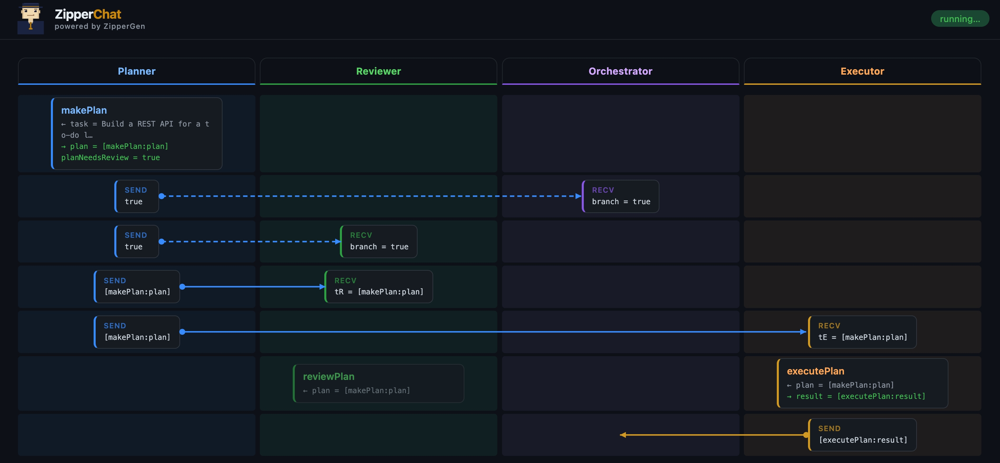

# ZipperGen

**Zip** (our mascot) literally keeps your agents in line. ZipperGen is a Python DSL and runtime for structured multi-agent LLM coordination, grounded in the theory of Message Sequence Charts. You write a single global protocol; ZipperGen projects it onto each agent and runs them concurrently.

If you just want to try it, start with the examples below. If you want the formal model behind the framework, see the forthcoming paper.

## Quick start

```bash
git clone https://github.com/zippergen-io/zippergen.git
cd zippergen
pip install -e .
```

Python 3.11 or later required.

## Hello, World!

Here is a small ZipperGen program. `User` sends a number to `Compute`, `Compute` increments it and doubles it, and the result is returned to the caller:

```python
from zippergen.syntax import Lifeline, Var
from zippergen.actions import pure
from zippergen.builder import workflow

User  = Lifeline("User")
Compute = Lifeline("Compute")

number = Var("number", int)

@pure
def inc(x: int) -> int:
    return x + 1

@pure
def double(x: int) -> int:
    return x * 2

@workflow
def increment(number: int @ User) -> int:
    User(number) >> Compute(number)
    with Compute:
        number = inc(number)
        number = double(number)
    Compute(number) >> User(number)
    return number @ User

result = increment(number=1)   # → 4
```

- `User(number) >> Compute(number)` — `User` sends `number` to `Compute`.
- `with Compute:` — a block of consecutive local actions on `Compute`.
- `return number @ User` — declares `User` as the lifeline that owns the result.

ZipperGen projects this global protocol onto each agent and runs them in parallel threads.

Run it with ZipperChat to see the live MSC diagram in your browser:

```bash
python examples/increment.py
```

## See it in action

The `diagnosis` example runs two LLMs through a medical consensus protocol until they agree.

1. Run it once with the built-in mock backend:

```bash
python examples/diagnosis.py
```

2. Open **http://localhost:8765**.

ZipperChat will show the agents exchanging messages in real time as a message sequence chart. By default, the example uses the mock backend, so no API key is needed.



## How it works

ZipperGen programs are *global coordination protocols*: you describe what messages flow between which agents and who owns each decision. ZipperGen then projects the global protocol onto per-agent local programs and executes them in parallel threads with FIFO message queues.

The key research idea is that coordination is written once, globally, and then compiled into local behavior. In the formal model, this gives a deadlock-freedom guarantee by construction.

Here is the full diagnosis protocol — two LLMs iterate until they agree on a verdict, or a round limit is reached:

```python
@workflow
def diagnosisConsensus(notes: str @ User, diagnosis: str @ User) -> str:
    # Distribute inputs to both LLMs
    User(notes, diagnosis) >> LLM1(notes, diagnosis)
    User(notes, diagnosis) >> LLM2(notes, diagnosis)

    # Independent initial assessments
    LLM1: (verdict, reason) = assess(notes, diagnosis)
    LLM2: (verdict, reason) = assess(notes, diagnosis)

    # Consensus loop — owned by LLM1 (at most MAX_ROUNDS rounds)
    while (not agreed and trials < MAX_ROUNDS) @ LLM1:
        LLM1(verdict, reason) >> LLM2(other_verdict, other_reason)
        LLM2(verdict, reason) >> LLM1(other_verdict, other_reason)
        LLM1: (verdict, reason) = reconsider(notes, diagnosis, verdict, reason, other_verdict, other_reason)
        LLM2: (verdict, reason) = reconsider(notes, diagnosis, verdict, reason, other_verdict, other_reason)
        LLM2(verdict) >> LLM1(other_verdict)
        with LLM1:
            agreed = checkAgreement(verdict, other_verdict)
            trials = incTrials(trials)
    else:                                              # runs once on loop exit
        LLM1(verdict, reason) >> LLM2(other_verdict, other_reason)

    # Final result computed by LLM1, returned to User
    LLM1: result = chooseResult(verdict, agreed)
    LLM1(result) >> User(result)
    return result @ User
```

The `@ LLM1` annotation mirrors the paper's notation `c@B`: it tells ZipperGen which agent evaluates the condition and broadcasts control messages to the others.

The formal foundation is developed in the forthcoming paper *"Provable Coordination for LLM Agents via Message Sequence Charts"*.

## Using real LLMs

The simplest way is:

1. Export your API key.
2. Change the `diagnosisConsensus.configure(...)` call in `examples/diagnosis.py` from `llms="mock"` to `llms=...`, or use the same call pattern in your own script.
3. Call the workflow like a normal Python function.

Built-in provider names are:

- `"openai"`
- `"mistral"`
- `"claude"` (alias: `"anthropic"`)

Example: both agents on OpenAI

```bash
export OPENAI_API_KEY=...
python examples/diagnosis.py
```

Set the workflow configuration to:

```python
diagnosisConsensus.configure(
    llms="openai",
    ui=True,
    timeout=600,
)

result = diagnosisConsensus(notes="...", diagnosis="...")
```

Example: one agent on Mistral, one on OpenAI

```bash
export MISTRAL_API_KEY=...
export OPENAI_API_KEY=...
python examples/diagnosis.py
```

Set the workflow configuration to:

```python
diagnosisConsensus.configure(
    llms={"LLM1": "mistral", "LLM2": "openai"},
    ui=True,
    timeout=600,
)
```

Example: one agent on Claude, one on OpenAI

```bash
export ANTHROPIC_API_KEY=...
export OPENAI_API_KEY=...
python examples/diagnosis.py
```

Set the workflow configuration to:

```python
diagnosisConsensus.configure(
    llms={"LLM1": "claude", "LLM2": "openai"},
    ui=True,
    timeout=600,
)
```

You can also turn the UI off:

```python
diagnosisConsensus.configure(
    llms="openai",
    ui=False,
)
result = diagnosisConsensus(notes="...", diagnosis="...")
```

The built-in backends read these optional environment variables:

| Variable | Default |
|---|---|
| `OPENAI_API_KEY` | — |
| `OPENAI_MODEL` | `gpt-4o-mini` |
| `MISTRAL_API_KEY` | — |
| `MISTRAL_MODEL` | `mistral-small-latest` |
| `ANTHROPIC_API_KEY` | — |
| `ANTHROPIC_MODEL` | `claude-sonnet-4-5` |

If you want full manual control, you can still pass a backend callable yourself:

```python
def my_backend(action, inputs):
    # action.system_prompt, action.user_prompt, action.outputs are available
    return {"verdict": True, "reason": "..."}

my_workflow.configure(backend=my_backend, timeout=60)
```
