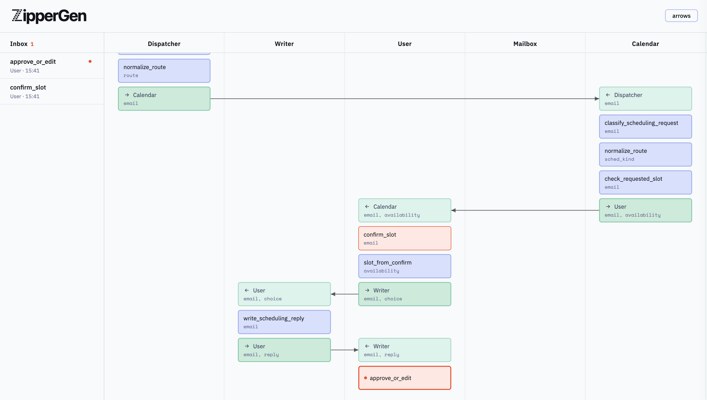
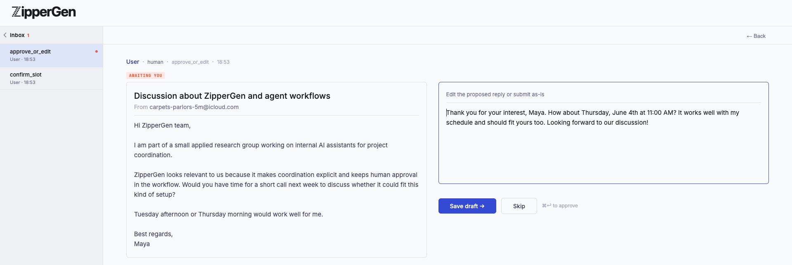

<p align="center">
  
</p>

<p align="center">
  <a href="https://github.com/zippergen-io/zippergen/actions/workflows/test.yml"></a>
  <a href="https://arxiv.org/abs/2604.17612"></a>
  <a href="https://github.com/zippergen-io/paper-isola/tree/main/Lean"></a>
  <a href="https://github.com/zippergen-io/paper-isola/tree/main/Lean"></a>
</p>

ZipperGen is a Python framework for AI workflows where several agents, tools, and humans must coordinate without ad-hoc message routing.

You write the workflow once as a global protocol: who sends what to whom, who runs which LLM, and who owns each decision. ZipperGen projects it to local agent programs automatically.

For well-formed workflows, the generated coordination is deadlock-free by construction. This follows from the projection discipline, not from runtime checking.

ZipperGen separates **what agents do** (LLM calls, tool use, human input) from **how they coordinate** (the protocol). The protocol is readable and auditable. It gives a compact description of the coordination logic.

Each participant is called a **lifeline**, which is the standard term from [Message Sequence Charts](https://en.wikipedia.org/wiki/Message_sequence_chart) (MSCs), the formalism ZipperGen is based on. In practice a lifeline is simply an agent: one sequential thread of execution that sends and receives messages.

Executions can be inspected as message sequence charts in ZipperChat.

<p align="center">
  <a href="https://zippergen.io/demo"><strong>Try the demo →</strong></a>
</p>



Clicking a human action opens a detail view with the full context and a form to respond.



## Quick start

```bash
git clone https://github.com/zippergen-io/zippergen.git
cd zippergen
pip install -e .
python examples/hello.py
```

Python 3.11 or later. No external dependencies: stdlib only (LLM backends optional).

## Hello, ZipperGen

Two lifelines, one LLM call, one message back.

```python
from zippergen.syntax import Lifeline
from zippergen.actions import llm
from zippergen.builder import workflow

User   = Lifeline("User")
Writer = Lifeline("Writer")

@llm(system="Write a concise reply.",
     user="{topic}", parse="text", outputs=(("draft", str),))
def write_reply(topic: str) -> None: ...

@workflow
def hello(topic: str @ User) -> str:
    User(topic) >> Writer(topic)
    Writer: draft = write_reply(topic)
    Writer(draft) >> User(draft)
    return draft @ User

hello.configure("mock", ui=True)
result = hello(topic="Say hello to ZipperGen")
print(result)
```

`User` sends a value to `Writer`, `Writer` runs an LLM action, and the result comes back. The workflow says explicitly who owns each step. Open **http://localhost:8765** to watch the exchange in ZipperChat.

Switch to a real LLM with one line:

```python
hello.configure("openai:gpt-4o", ui=True)   # or "mistral", "claude"
```

The full example is at `examples/hello.py`.

## Owned decisions

The previous example has no coordination choice. Here is the first place where ZipperGen matters more: one lifeline owns a decision, and ZipperGen generates the required coordination messages automatically.

Three agents collaborate: `Writer` drafts a reply to an incoming email, `Editor` decides whether it is ready to send, and `Writer` revises if needed.

```python
from zippergen.syntax import Lifeline
from zippergen.actions import llm
from zippergen.builder import workflow

User   = Lifeline("User")
Writer = Lifeline("Writer")
Editor = Lifeline("Editor")

@llm(system="Draft a concise email reply.",
     user="{email}", parse="text", outputs=(("draft", str),))
def draft_reply(email: str) -> None: ...

@llm(system="Is this reply accurate and appropriate? Reply true or false.",
     user="{draft}", parse="bool", outputs=(("approved", bool),))
def approve_reply(draft: str) -> None: ...

@llm(system="Revise the reply to be clearer and more direct.",
     user="{draft}", parse="text", outputs=(("draft", str),))
def revise_reply(draft: str) -> None: ...

@workflow
def review_draft(email: str @ User) -> str:
    User(email) >> Writer(email)
    Writer: draft = draft_reply(email)
    Writer(draft) >> Editor(draft)
    Editor: approved = approve_reply(draft)
    if approved @ Editor:
        Editor(draft) >> User(draft)
    else:
        Editor(draft) >> Writer(draft)
        Writer: draft = revise_reply(draft)
        Writer(draft) >> User(draft)
    return draft @ User
```

`if approved @ Editor` is the key line. `Editor` owns the branching decision; ZipperGen automatically determines which agents need to receive that decision and generates the coordination messages. You don't write any routing code.

The same coordination pattern is at `examples/write_tweet.py`.

## Why protocols?

In most multi-agent frameworks, control flow lives inside each agent. Agents call tools, decide what to do next, and rely on the other agents being ready to receive. This works until a subtle ordering problem causes two agents to wait on each other indefinitely.

ZipperGen works differently. You write the control flow once, as a global protocol. ZipperGen then *projects* that protocol onto each agent: each agent receives exactly the local view of the global plan that it needs. Because every send has a corresponding receive by construction, deadlock cannot occur for well-formed protocols. This is a structural property, not something checked at runtime.

This protocol-first style is close to [choreographic programming](https://en.wikipedia.org/wiki/Choreographic_programming): the distributed behavior is written globally and then projected to local participants. ZipperGen uses an MSC-based formal model and adapts this idea to LLM actions, tool calls, human control points, and runtime inspection.

The formal statement is in [our paper](https://arxiv.org/abs/2604.17612): the projected programs produce exactly the same behaviors as the global program, and deadlock-freedom follows by structural induction.

The practical consequence: the global protocol is also a complete audit trail of what your agents are allowed to do. You can read it, reason about it, and show it to anyone who needs to understand how the system works.

## ZipperChat

Each lifeline gets its own column. Actions, messages, and human task events appear as cards as they happen. ZipperChat is now treated as a legacy visualization surface, not the primary deployment approval channel. For deployed systems, human approvals should go through SQLite-backed adapters such as `zippergen approve`, `zippergen notify telegram`, email, or Slack.

For local visualization, start a workflow with `ui=True` and open **http://localhost:8765**. Pass `show_decisions=True` to also show branch decisions and control broadcasts.

For applications that run several workflows from ordinary Python code, ZipperChat can show multiple independent runs on the same page:

```python
from zipperchat import WebTrace

dashboard = WebTrace.dashboard().start()
first_workflow.configure(ui=True, trace=dashboard)
second_workflow.configure(ui=True, trace=dashboard)
```

## Examples

Start without API keys:

```bash
python examples/hello.py                        # two lifelines, one LLM call
python examples/write_tweet.py                  # owned-decision loop
python examples/parallel.py                     # fan-out / fan-in across branches
python examples/human_approval.py               # legacy browser approval demo
python examples/command_center.py --llm mock    # long-running dashboard with two event loops
```

Coordination patterns (requires an API key):

```bash
python examples/diagnosis.py                    # two LLMs reach consensus iteratively
python examples/contract_review.py              # parallel review with owned branching
python examples/morning_digest.py               # inbox triage
```

Advanced:

```bash
python examples/planner.py                      # LLM generates a sub-workflow at runtime
python examples/cpl_test.py                     # causal runtime guard
python examples/dashboard.py                    # multi-run ZipperChat page
python examples/write_tweet_local.py            # local OpenAI-compatible model server
```

## Using real LLMs

Export your API key and pass the LLM spec to `configure()`:

```bash
export OPENAI_API_KEY=...
```

```python
workflow.configure("openai:gpt-4o", ui=True, timeout=600)
```

Supported specs: `"mock"`, `"openai:<model>"`, `"ollama:<model>"`, `"mistral:<model>"`, `"claude:<model>"`. You can omit the model and use env defaults, for example `"openai"`. For per-agent routing: `llm={"Writer": "openai:gpt-4o", "Editor": "mistral"}`.

## Local Deployment

Run a workflow from the command line with a persistent SQLite store:

```bash
zippergen run examples/hello.py:hello \
  --llm openai:gpt-4o \
  --store ~/.zippergen/runs/hello.sqlite \
  --input topic="Say hello to ZipperGen"
```

The workflow spec can be `module:workflow` or `path.py:workflow`. If `--store` is omitted, `zippergen run` creates a stable local store under `~/.zippergen/runs/`. Restart the same command with the same store to replay committed work and continue from SQLite.

Use `--ui` only when you want the legacy ZipperChat visualization attached to the run. Deployment approvals are still owned by SQLite tasks and notification adapters.

Inspect a local deployment store:

```bash
zippergen status --store ~/.zippergen/runs/hello.sqlite
zippergen status --store ~/.zippergen/runs/hello.sqlite --json
zippergen trace --store ~/.zippergen/runs/hello.sqlite --tail 50
zippergen trace --store ~/.zippergen/runs/hello.sqlite --after <rowid> --json
```

For long-running local deployments, create a named profile instead of
remembering the full command:

```bash
zippergen deploy-local examples/hello.py:hello \
  --name hello \
  --llm openai:gpt-4o \
  --input topic="Say hello to ZipperGen"

zippergen run-deployment hello
zippergen status hello
zippergen trace hello --tail 50
zippergen logs hello --tail 100
```

The profile is written under `~/.zippergen/deployments/`, with a stable SQLite
store under `~/.zippergen/runs/`, a log path under `~/.zippergen/logs/`, and a
generated systemd user-service template. This is the first step toward
`zippergen deploy`; it avoids operational archaeology while keeping secrets out
of the repository.

On Linux systems with user-level systemd, ZipperGen can install and control the
generated service directly:

```bash
zippergen start hello --enable
zippergen restart hello
zippergen stop hello
```

List and complete human approvals without the browser UI:

```bash
zippergen tasks --store ~/.zippergen/runs/command-center.sqlite
zippergen approve --store ~/.zippergen/runs/command-center.sqlite --task <task-id>
zippergen approve --store ~/.zippergen/runs/command-center.sqlite --task <task-id> --no
zippergen approve --store ~/.zippergen/runs/command-center.sqlite --task <task-id> --value "edited reply"
```

External adapters can use durable approval tokens instead of raw task ids:

```bash
zippergen tasks --store ~/.zippergen/runs/command-center.sqlite --tokens --channel telegram
zippergen approve --store ~/.zippergen/runs/command-center.sqlite --token <token>
```

The first notification adapter prints pending tasks with approval commands:

```bash
zippergen notify stdout --store ~/.zippergen/runs/command-center.sqlite --channel telegram
zippergen notify stdout --store ~/.zippergen/runs/command-center.sqlite --channel telegram --watch
```

Telegram approvals are available as a real notification adapter:

```bash
export ZIPPERGEN_TELEGRAM_TOKEN=<bot-token>
export ZIPPERGEN_TELEGRAM_CHAT_ID=<chat-id>
zippergen notify telegram --store ~/.zippergen/runs/command-center.sqlite --watch
```

For deeper setup details, see the beginner deployment booklet in
[`docs/local-deployment.md`](docs/local-deployment.md).

Workflow modules may define an optional setup hook:

```python
def zippergen_setup(config):
    if config.option("services", "fake") == "live":
        ...
```

Pass hook options with `--option name=value`. For the command center:

```bash
zippergen run examples/command_center.py:command_center \
  --llm openai:gpt-4o \
  --services live \
  --store ~/.zippergen/runs/command-center.sqlite \
  --timeout 0
```

For local models, add an idle timeout so the model can be released while the workflow keeps running:

```bash
zippergen run examples/command_center.py:command_center \
  --llm ollama:qwen2.5:7b \
  --services live \
  --llm-idle-timeout 300 \
  --store ~/.zippergen/runs/command-center.sqlite \
  --timeout 0
```

The call-intake deployment example watches certified email senders, extracts
calls for projects/positions/grants into a CSV table, sends JSON replies, and
accepts corrected replies. Automatic sending is capped at 10 emails per hour:

```bash
export ZIPPERGEN_CALL_INTAKE_SEND_MODE=send
export ZIPPERGEN_CALL_INTAKE_MAX_EMAILS_PER_HOUR=10
export ZIPPERGEN_CALL_INTAKE_POLL_SECONDS=60

zippergen run examples/call_intake.py:call_intake \
  --llm openai:gpt-4o \
  --services live \
  --store ~/.zippergen/runs/call-intake.sqlite \
  --timeout 0
```

## Formal foundation

The implementation is based on the theory of [Message Sequence Charts](https://en.wikipedia.org/wiki/Message_sequence_chart) and [choreographic programming](https://en.wikipedia.org/wiki/Choreographic_programming). A workflow is written from a global point of view and projected to local participants; ZipperGen adapts this to LLM actions, tool calls, human control points, and runtime inspection.

The key properties:

- **Correctness**: The distributed projected programs produce exactly the same behaviors as the global program.
- **Deadlock-freedom**: Follows by structural induction; no runtime checking required.

The main theorems (Theorem 3.1 and Corollary 3.1) have been machine-checked in Lean 4; see the [formalization](https://github.com/zippergen-io/paper-isola/tree/main/Lean).

Bollig, Függer, Nowak. [*Provable Coordination for LLM Agents via Message Sequence Charts.*](https://arxiv.org/abs/2604.17612) arXiv:2604.17612 [cs.PL]

Bollig. [*Causal Past Logic for Runtime Verification of Distributed LLM Agent Workflows.*](https://arxiv.org/abs/2605.20923) arXiv:2605.20923 [cs.LO]

## License

ZipperGen is released under the Apache License 2.0. See [`LICENSE`](LICENSE) for the full terms.
