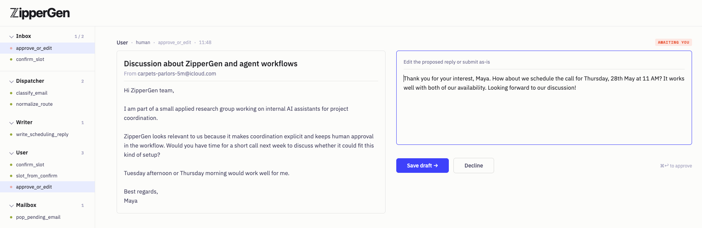

# ZipperGen

[](https://github.com/zippergen-io/zippergen/actions/workflows/test.yml)
[](https://arxiv.org/abs/2604.17612)

ZipperGen is a Python framework for multi-agent LLM coordination. You write a single global protocol (who sends what to whom, who runs which LLM, who owns each decision), and ZipperGen projects it onto each agent automatically. If the protocol compiles, it cannot deadlock. This is not a runtime check; it follows from how the projection works.

ZipperGen separates **what agents do** (LLM calls and pure functions) from **how they coordinate** (the protocol). Unlike tool-calling frameworks where agents decide the control flow themselves, coordination in ZipperGen is explicit, written once, and verified by construction.

## Quick start

```bash
git clone https://github.com/zippergen-io/zippergen.git
cd zippergen
pip install -e .
```

Python 3.11 or later required. No external dependencies: stdlib only (LLM backends optional).

## Hello, World

Three agents collaborate: `Writer` drafts a tweet, `Editor` decides whether it's good enough, and ZipperGen handles the coordination. No API key needed; the built-in mock backend runs instantly.

```python
from zippergen.syntax import Lifeline, Var
from zippergen.actions import llm
from zippergen.builder import workflow

User   = Lifeline("User")
Writer = Lifeline("Writer")
Editor = Lifeline("Editor")

tweet    = Var("tweet",    str)
approved = Var("approved", bool)

@llm(system="Write a one-sentence tweet about the topic.",
     user="{topic}", parse="text", outputs=(("tweet", str),))
def draft(topic: str) -> None: ...

@llm(system="Is this tweet engaging and under 280 chars? Reply true or false.",
     user="{tweet}", parse="bool", outputs=(("approved", bool),))
def approve(tweet: str) -> None: ...

@llm(system="Improve this tweet: shorter and punchier.",
     user="{tweet}", parse="text", outputs=(("tweet", str),))
def revise(tweet: str) -> None: ...

@workflow
def write_tweet(topic: str @ User) -> str:
    User(topic) >> Writer(topic)
    Writer: tweet = draft(topic)
    Writer(tweet) >> Editor(tweet)
    Editor: approved = approve(tweet)
    if approved @ Editor:
        Editor(tweet) >> User(tweet)
    else:
        Editor(tweet) >> Writer(tweet)
        Writer: tweet = revise(tweet)
        Writer(tweet) >> User(tweet)
    return tweet @ User

# No API key needed; runs with the built-in mock backend.
# Switch to a real LLM: write_tweet.configure(llms="openai")
result = write_tweet(topic="a git commit message that tells the truth")
print(result)
```

`if approved @ Editor` is the key line. `Editor` owns the branching decision; ZipperGen automatically determines which agents need to receive that decision and generates the coordination messages. You don't write any routing code.

The mock backend produces placeholder output (`[draft:tweet]`, `[revise:tweet]`). Add one line to switch to a real LLM:

```python
write_tweet.configure(llms="openai")   # or "mistral", "claude"
result = write_tweet(topic="a git commit message that tells the truth")
```

The full example is at `examples/write_tweet.py`.

## Why it can't deadlock

In most multi-agent frameworks, control flow lives inside each agent. Agents call tools, decide what to do next, and rely on the other agents being ready to receive. This works until a subtle ordering problem causes two agents to wait on each other indefinitely.

ZipperGen works differently. You write the control flow once, as a global protocol. ZipperGen then *projects* that protocol onto each agent: each agent receives exactly the local view of the global plan that it needs. Because every send has a corresponding receive by construction, deadlock cannot occur. This is a structural property, not something checked at runtime.

The formal statement is in [our paper](https://arxiv.org/abs/2604.17612): the projected programs produce exactly the same behaviors as the global program, and deadlock-freedom follows by structural induction.

The practical consequence: the global protocol is also a complete audit trail of what your agents are allowed to do. You can read it, reason about it, and submit it to anyone who needs to understand how the system works.

## See it in action

Examples ship with the repo. The first two run without an API key.

```bash
python examples/write_tweet.py        # draft-and-approve with mock LLM (no key needed)
python examples/diagnosis.py          # two LLMs reach consensus iteratively (no key needed with mock)
python examples/contract_review.py    # four agents review a contract in parallel (needs MISTRAL_API_KEY)
python examples/morning_digest.py     # inbox triage: parallel analysis, owned branching (needs MISTRAL_API_KEY)
python examples/arithmetic_planner.py # LLM decomposes and evaluates an arithmetic expression in parallel (needs OPENAI_API_KEY)
python examples/planner.py            # LLM designs and runs its own sub-workflow (needs OPENAI_API_KEY)
```

Open **http://localhost:8765** to watch the agents exchange messages in real time as a message sequence chart.



## How it works

ZipperGen programs are global coordination protocols: you describe what messages flow between which agents and who owns each decision. ZipperGen projects the global protocol onto per-agent local programs and executes them in parallel threads with FIFO message queues.

### Diagnosis consensus

Two LLMs independently assess a case, then iterate until they agree or a round limit is reached:

```python
@workflow
def diagnosis_consensus(notes: str @ User, diagnosis: str @ User) -> str:
    # Distribute inputs to both LLMs
    User(notes, diagnosis) >> LLM1(notes, diagnosis)
    User(notes, diagnosis) >> LLM2(notes, diagnosis)

    # Independent initial assessments
    LLM1: (verdict, reason) = assess(notes, diagnosis)
    LLM2: (verdict, reason) = assess(notes, diagnosis)

    # Consensus loop, owned by LLM1 (at most MAX_ROUNDS rounds)
    while (not agreed and trials < MAX_ROUNDS) @ LLM1:
        LLM1(verdict, reason) >> LLM2(other_verdict, other_reason)
        LLM2(verdict, reason) >> LLM1(other_verdict, other_reason)
        LLM1: (verdict, reason) = reconsider(notes, diagnosis, verdict, reason, other_verdict, other_reason)
        LLM2: (verdict, reason) = reconsider(notes, diagnosis, verdict, reason, other_verdict, other_reason)
        LLM2(verdict) >> LLM1(other_verdict)
        with LLM1:
            agreed = check_agreement(verdict, other_verdict)
            trials = inc_trials(trials)

    # Final result computed by LLM1, returned to User
    LLM1: result = choose_result(verdict, agreed)
    LLM1(result) >> User(result)
    return result @ User
```

`while cond @ LLM1` means LLM1 owns the loop guard and broadcasts the decision each iteration. `if cond @ Owner` works the same way for conditionals. ZipperGen figures out which other agents need to receive the decision and generates the control messages automatically.

Every workflow has exactly one `return var @ Lifeline`, at the end. This declares which lifeline owns the result once all agents have finished: it is a declaration, not a control flow statement. No matter which branches executed, the result always lands in the same place.

## Defining LLM actions

Prompts are defined directly on Python functions with `@llm`. The `parse` parameter controls how the response is interpreted, and determines what `outputs` must look like:

**`parse="json"`**: multiple typed outputs; ZipperGen appends a JSON instruction and validates the response:

```python
@llm(
    system="You are a medical expert. Analyze the notes and determine if the diagnosis applies.",
    user="Notes: {notes}\nDiagnosis: {diag}",
    parse="json",
    outputs=(("verdict", bool), ("reason", str)),   # one or more (name, type) pairs
)
def assess(notes: str, diag: str) -> None: ...
```

**`parse="text"`**: exactly one `str` output; the model's raw response is returned as-is:

```python
@llm(
    system="You are a medical writer. Summarise the following notes in one paragraph.",
    user="{notes}",
    parse="text",
    outputs=(("summary", str),),                    # exactly one str entry
)
def summarise(notes: str) -> None: ...
```

**`parse="bool"`**: exactly one `bool` output; the model is asked to reply `true` or `false`:

```python
@llm(
    system="Do the two verdicts agree?",
    user="Verdict A: {v1}\nVerdict B: {v2}",
    parse="bool",
    outputs=(("agreed", bool),),                    # exactly one bool entry
)
def check_agreement(v1: str, v2: str) -> None: ...
```

## Dynamic planning

For tasks where the coordination structure isn't known in advance, `@planner` lets an LLM design the workflow at runtime. Give it a description, an action vocabulary, and a set of lifelines; it generates a complete sub-workflow, which ZipperGen validates and executes.

Actions in the vocabulary can be atomic tools (`@pure` functions or `@llm` calls) or full skills: entire `@workflow`s that appear to the planner as a single typed action but internally run their own verified coordination protocol.

Here the planner receives an arithmetic expression and must evaluate it using three Calculator lifelines with maximum parallelism, guarding against division by zero:

```python
@planner(
    description="Evaluate an arithmetic expression with maximum parallelism. "
                "Identify independent subexpressions and evaluate them concurrently. "
                "If the expression is undefined (division by zero), return 0.",
    actions=[add, subtract, multiply, divide, identity, is_zero],
    lifelines=[Calculator1, Calculator2, Calculator3],
    allow=["if"],
)
def evaluate(expression: str) -> str: ...
```

The decorated function slots into a `@workflow` like any other action. Given `(2 - 4) * (2 + 3) + (3 / (3 - 2))`, GPT-4o generates:

```python
@workflow
def generated_workflow(expression: str @ Planner) -> str:
    Planner() >> Calculator1()
    Planner() >> Calculator2()
    Planner() >> Calculator3()

    Calculator1: subtract1 = subtract(2.0, 4.0)          # (2 - 4) = -2  ─┐
    Calculator2: add1      = add(2.0, 3.0)               # (2 + 3) =  5  ─┤ parallel
    Calculator3: subtract2 = subtract(3.0, 2.0)          # (3 - 2) =  1  ─┘
    Calculator3: zero      = is_zero(subtract2)          # check before dividing

    if zero @ Calculator3:
        Calculator3(0.0) >> Planner(result)              # guard: return 0
    else:
        Calculator3: divide1   = divide(3.0, subtract2)  # 3 / 1 = 3

        Calculator2(add1)    >> Calculator1(add1)
        Calculator3(divide1) >> Calculator1(divide1)

        Calculator1: multiply1 = multiply(subtract1, add1)   # -2 * 5 = -10
        Calculator1: result    = add(multiply1, divide1)     # -10 + 3 = -7
        Calculator1(result) >> Planner(result)

    return result @ Planner
```

The LLM parsed the expression, identified that `(2 - 4)`, `(2 + 3)`, and `(3 - 2)` are all independent, evaluated them in parallel across three calculators, checked the denominator before dividing, and wired the join correctly, all from the description and action vocabulary alone. ZipperGen validates the generated workflow structurally before running it.

**`allow`** controls extensions: `"pure"` (define helper functions), `"llm"` (define new LLM actions), `"if"` (conditional branching), `"while"` (loops). Default is `[]` (pre-defined vocabulary only, linear workflows).

## Using real LLMs

The simplest way is to export your API key and set `llms=` in `configure()`.

**All agents on the same provider:**

```bash
export OPENAI_API_KEY=...
```

```python
diagnosis_consensus.configure(llms="openai", ui=True, timeout=600)
```

**Different providers per agent:**

```bash
export MISTRAL_API_KEY=...
export OPENAI_API_KEY=...
```

```python
diagnosis_consensus.configure(
    llms={"LLM1": "mistral", "LLM2": "openai"},
    ui=True,
    timeout=600,
)
```

**Different API keys per agent** (useful for parallel rate limits):

```python
from zippergen.backends import make_openai_backend

contractReview.configure(
    llms={
        "Jurisdiction":    make_openai_backend(api_key="sk-..."),
        "Liability":       make_openai_backend(api_key="sk-..."),
        "Confidentiality": make_openai_backend(api_key="sk-..."),
        "Orchestrator":    "mistral",
    },
    timeout=600,
)
```

Built-in provider names: `"openai"`, `"mistral"`, `"claude"` (alias: `"anthropic"`).

The built-in backends read these environment variables:

| Variable | Default |
|---|---|
| `OPENAI_API_KEY` | (required) |
| `OPENAI_MODEL` | `gpt-4o-mini` |
| `MISTRAL_API_KEY` | (required) |
| `MISTRAL_MODEL` | `mistral-small-latest` |
| `ANTHROPIC_API_KEY` | (required) |
| `ANTHROPIC_MODEL` | `claude-sonnet-4-6` |

**Custom backend:**

```python
def my_backend(action, inputs):
    # action.system_prompt, action.user_prompt, action.outputs available
    return {"verdict": True, "reason": "..."}

my_workflow.configure(backend=my_backend, timeout=60)
```

## Why not LangGraph / CrewAI / AutoGen?

The short answer: those frameworks leave coordination up to the agents or the graph structure. ZipperGen makes coordination explicit and proves it correct.

**LangGraph** uses a graph of nodes and edges. Conditional branching requires a router function that returns the name of the next node. The graph structure implies an execution order, but deadlock avoidance and correctness are your responsibility. It's a good fit when you need fine-grained control over an irregular flow and are comfortable reasoning about the graph yourself.

**CrewAI and AutoGen** are conversation-based: agents exchange messages and decide what to do next. The coordination is mostly emergent from the agent prompts. This works well for open-ended tasks where you can't or don't want to specify the coordination structure in advance. The tradeoff is that the system's behavior is hard to audit and impossible to prove correct.

**ZipperGen** requires you to write the coordination structure explicitly. That's a constraint. In return, you get a protocol that can be read by a person, checked by a tool, and submitted to anyone who needs to understand how the system behaves, along with a proof that it terminates without deadlock. If your use case involves a fixed or semi-fixed coordination structure (which most production systems do), the explicitness is an asset.

If the structure genuinely isn't known in advance, use `@planner`; the LLM generates the sub-workflow, ZipperGen validates it structurally, and the guarantee still holds.

## Formal foundation

The implementation is grounded in the theory of Message Sequence Charts. The key properties:

- **Correctness**: The distributed projected programs produce exactly the same behaviors as the global program.
- **Deadlock-freedom**: Follows by structural induction; no runtime checking required.

The formal proofs are in [our paper](https://arxiv.org/abs/2604.17612).
