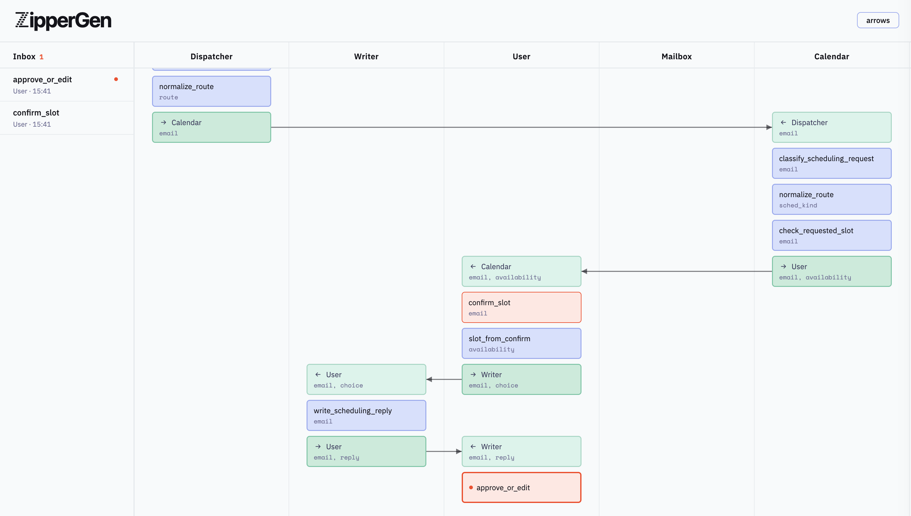
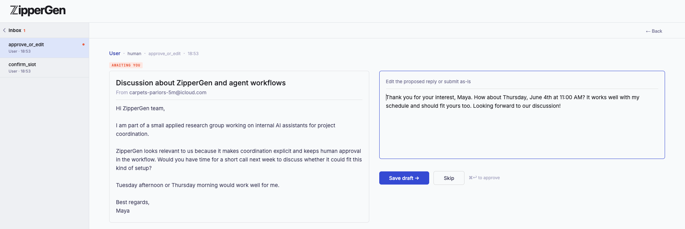

<p align="center">
  
</p>

<p align="center">
  <a href="https://github.com/zippergen-io/zippergen/actions/workflows/test.yml"></a>
  <a href="https://arxiv.org/abs/2604.17612"></a>
  <a href="https://github.com/zippergen-io/paper-isola/tree/main/Lean"></a>
  <a href="https://github.com/zippergen-io/paper-isola/tree/main/Lean"></a>
</p>

ZipperGen is a Python framework for AI workflows where several agents, tools, and humans must coordinate without ad-hoc message routing.

You write the workflow once as a global protocol: who sends what to whom, who runs which LLM, and who owns each decision. ZipperGen projects it to local agent programs automatically.

For well-formed workflows, the generated coordination is deadlock-free by construction. This follows from the projection discipline, not from runtime checking.

ZipperGen separates **what agents do** (LLM calls, tool use, human input) from **how they coordinate** (the protocol). The protocol is readable and auditable. It gives a compact description of the coordination logic.

Each participant is called a **lifeline**, which is the standard term from [Message Sequence Charts](https://en.wikipedia.org/wiki/Message_sequence_chart) (MSCs), the formalism ZipperGen is based on. In practice a lifeline is simply an agent: one sequential thread of execution that sends and receives messages.

Executions can be inspected as message sequence charts in ZipperChat.

<p align="center">
  <a href="https://zippergen.io/demo"><strong>Try the demo →</strong></a>
</p>



Clicking a human action opens a detail view with the full context and a form to respond.



## Quick start

New to ZipperGen? Follow
**[Your First ZipperGen Workflow](docs/first-workflow.tex)** for the short,
self-contained path from a new project and natural-language specification to
inspection, durable mock execution, recovery, and a prepared deployment. Use
the **[Development and Deployment Manual](docs/workflow-development-deployment-guide.tex)**
for concepts, complete configuration, command reference, operations, and
troubleshooting.

```bash
git clone https://github.com/zippergen-io/zippergen.git
cd zippergen
uv sync
uv run zippergen
```

Python 3.11 or later. `prompt-toolkit` provides Studio's interactive terminal
experience; LLM backends remain optional. `pip install -e .` is an alternative
to `uv sync`.

## ZipperGen Studio

Running `zippergen` with no subcommand opens the project-aware development
workspace. It discovers the Git/project root, remembers the current workflow,
and makes the main path visible through `help` and numbered selectors.

Studio supports project-aware Tab completion. Command and subcommand menus are
supplemented with the workflows, participants, LLM-active participants,
providers, remembered deployment, and project files that are valid at the
cursor. When only one match exists, the bottom toolbar still displays its
description; multiple matches show their descriptions in the completion menu.
Up/down arrows navigate private per-project command history; a faint
history suggestion can be accepted with the right arrow. Piped commands and
programmatic callers retain the ordinary non-interactive input path.

The public command surface follows four visible namespaces:

- `workflow` — specify, implement, inspect, and validate the application;
- `models` — configure, check, and assign model configurations;
- `deployment` — distinguish the installed bundle, supervised service, durable
  run, and store;
- `store` — select and inspect durable state, human tasks, and traces without
  copying SQLite paths.

The short verbs `run` and `deploy` begin the two operational paths. Legacy
top-level `status`, `doctor`, `logs`, `start`, `restart`, and `stop` forms
remain accepted, but help and completion present the clearer `deployment
show`, `deployment doctor`, and related forms.

This keeps related steps together. For example, the complete design loop is
discoverable below `workflow`, from `workflow create` through `workflow
implement`, the guided `workflow review`, and `workflow accept`.
Plain `help` shows that short path and these areas; `help all` prints the
complete exact reference. Command metadata is declared once and reused for
help, completion, natural-language permissions, and risk classification.
Workflow-view names, labels, aliases, rendering options, and completion
descriptions likewise come from one view registry.

Durable runs also expose their current projected program positions:

```text
run inspect
run inspect Reviewer
deployment inspect reviewed-answer
deployment inspect reviewed-answer Reviewer
```

The overview is bounded by the workflow and participant count rather than by
trace length. It shows whether each participant is running, waiting to
receive, waiting for a human, executing a model/assistant/effect action, or
finished. Focusing a participant renders its exact local projection with
`▶` on every active branch. These are diagnostic observation records,
separate from recovery snapshots; workflow variables, action inputs, and
secrets are not displayed. Because a foreground development run owns its
terminal, inspect it concurrently from another project-root terminal with
`zippergen studio --command "run inspect Reviewer"`. Background deployments
can be inspected directly from the ordinary Studio prompt.

After updating an editable ZipperGen checkout in another terminal, enter
`studio restart` to replace the current Studio process and import the updated
source. It preserves the working directory and reloads the project context
saved on disk; it does not start a nested Studio. This command does not run
`git pull`, install dependencies, or synchronize the environment. If the
update changes dependencies, leave Studio, run `uv sync` (or reinstall the
tool), and start `zippergen` again. `deployment restart [NAME]` restarts an
installed deployment.

`studio doctor` checks the local development front door without contacting a
model provider: project manifest, terminal editor, configured coding
assistant, and natural-language interpreter fallback. The welcome banner
reports coding-assistant availability and one lifecycle-aware `Next` command.
Codex and Claude remain optional external tools with their own installation
and authentication; they are not Python package dependencies.

For workflow development, the application project may be separate from the
framework checkout. This is especially useful while developing ZipperGen from
source:

```text
zippergen-tutorial/          # project, Git root, and coding-assistant root
├── .zippergen/              # generated current task; ignored by Git
├── zippergen.toml           # visible project contract
├── specification.md         # canonical, versionable design intent
├── workflows/
├── tests/
└── zippergen/               # optional local framework checkout
```

Pass the parent with `zippergen studio --project PATH` for the first session.
Inside Studio, `project init [NAME]` creates `zippergen.toml` and safe Git
ignores; `workflow create` adds `specification.md`. A manifest takes precedence during
later project discovery; an explicit `--project` path is always used exactly.

When using a nested editable checkout, expose its CLI once and initialize the
parent from the parent directory:

```bash
uv tool install --force --editable ./zippergen
zippergen studio --project .
```

Then enter `project init NAME` inside Studio. Subsequent sessions need only the
short `zippergen` command from the parent project root. `project rename
"NEW NAME"` later changes only this logical, versioned name; the project
directory, workflows, deployments, and private workspace identity stay put.

```text
$ uv run zippergen
ZipperGen Studio
Project: zippergen
Root: /path/to/zippergen
No workflow selected.

zippergen [no workflow]> workflow list

╭──────────────────────────────────────────────────────────╮
│ ZipperGen Studio · workflow list                         │
╰──────────────────────────────────────────────────────────╯
Available workflows
  1  tutorial_review — examples/tutorial_review.py:tutorial_review
  ...

zippergen [no workflow]> workflow select 1
zippergen [tutorial_review]> workflow show

╭──────────────────────────────────────────────────────────╮
│ ZipperGen Studio · workflow show                         │
╰──────────────────────────────────────────────────────────╯
  1. Authored source
  2. Overview
  3. Protocol
  4. Communications only
  5. Actions and prompts
  6. Complete workflow
  7. One participant
  8. Selected participants

zippergen [tutorial_review]> run
```

Studio gives every outcome the same compact visual language: green `✓` means
an operation or check succeeded, yellow `⚠` means attention or incomplete
optional setup, and red `✗` means the command or check failed. The symbols
remain in plain output, while ANSI color is enabled only on an interactive
terminal. Redirected output, `NO_COLOR`, and the scriptable CLI's JSON modes
remain color-free.

Interactive commands also begin with a connected three-line banner. The blank
line and boxed `ZipperGen Studio · current` label separate the echoed command
from its prompts, tables, warnings, or errors. Only the command family is
shown; prompt text, paths, model specifications, and secret values are never
repeated in the banner. Empty input and `exit` produce no banner. The optional
`settings set output compact` switches to a one-line boundary.

Inside that boundary, every structured result follows the same hierarchy:
section title and rule, explicit column headings, a second rule separating
those headings from actual rows, and a standalone `Next` section when guidance
is useful. Status messages precede the data they describe. Project, workflow,
model, language, run, and deployment output all use this shared rendering.
Long values and multi-column rows wrap within the terminal width rather than
extending beyond their rules. Managed `run` and `resume` output uses the same
renderer instead of printing a separate set of bare status strings.

`current` is the concise project dashboard: project and manifest, canonical
specification and pending-refinement state, workflow name, all participants,
the explicit subset containing `@llm` actions, human actions, external effects,
validation state, effective per-lifeline model assignments, provider
readiness, connector bindings, run, and deployment. It remains useful before a
workflow exists; unknown fields are shown as `none` rather than guessed.

Connector bindings are intentionally reported but not configured in this
slice. Future Gmail, Google Sheets, Telegram, email, and human-channel adapters
will bind to declared lifeline capabilities without conflating the lifeline's
authority with credentials or transport configuration.

Before collecting inputs, `run` validates and freshly checks exactly the model
configurations used by LLM-active participants. It then creates a unique
durable SQLite run automatically and presents human decisions in the same
terminal. There are no store paths, task IDs, or environment exports to manage.
If the terminal closes during an incomplete run, return to the project and
enter `resume`. Use `current` to see the remembered workflow, run, and
deployment context. Terminal human actions are always presented by the
supervisor's main thread, so `Ctrl-C` leaves the durable task pending, stops the
role threads before Studio accepts another command, and allows an immediate
`resume` without competing readers on stdin.

Use `models` for three explicit layers: **provider → configuration →
assignment**. First configure an API key or local endpoint. Then create a
reusable name for one provider/model pair. Finally assign that name to each
LLM-active participant. `models setup` guides all three stages:

```text
zippergen [tutorial_review]> models default mock
zippergen [tutorial_review]> models provider configure openai
OPENAI_API_KEY:
zippergen [tutorial_review]> models config create writer-fast
Provider [openai]:
Model identifier [gpt-4o-mini]:
zippergen [tutorial_review]> models config check writer-fast
zippergen [tutorial_review]> models assign Writer writer-fast
zippergen [tutorial_review]> models config rename writer-fast drafting
zippergen [tutorial_review]> models provider configure anthropic
zippergen [tutorial_review]> models config create careful-reviewer
Provider [anthropic]:
Model identifier [claude-sonnet-4-6]:
zippergen [tutorial_review]> models config check careful-reviewer
zippergen [tutorial_review]> models assign Reviewer careful-reviewer
zippergen [tutorial_review]> models assignments
zippergen [tutorial_review]> models assignments check
```

For a local OpenAI-compatible endpoint, configure the endpoint before naming a
model configuration:

```text
zippergen [tutorial_review]> models
zippergen [tutorial_review]> models provider configure local http://127.0.0.1:11434/v1
zippergen [tutorial_review]> models config create local-writer
Provider [local]:
Model identifier [qwen2.5:7b]:
zippergen [tutorial_review]> models config check local-writer
zippergen [tutorial_review]> models assign Writer local-writer
```

API keys are entered without echo and remain in owner-only Studio secret
storage. Local endpoint settings and non-secret routing are remembered, while
`models` displays connections without ever displaying a key or contacting a
remote API. `models provider configure NAME` saves the connection and checks
it; `models provider check [NAME]` repeats that connectivity/model-list check
later. The dashboard always distinguishes merely configured providers from
timestamped successful or failed checks.

`models config create NAME` asks for a configured provider and exact model,
then saves the resulting reusable configuration as unchecked. It never asks
for an API key: if the provider is missing, Studio stops with the precise
`models provider configure ...` command to run first. `models config check NAME`
queries the provider and records `available`, `unverified`, or `unavailable`
without changing any assignment. `models config check` checks every saved
configuration. `models assign LIFELINE NAME` and `models default NAME` only
route saved configurations; they do not contact a provider. Assigning an
unchecked configuration is allowed but clearly warned about; a configuration
known to be unavailable must be fixed or checked successfully first. Local
model identifiers are checked against the endpoint's live model list.
`models assignments` shows each effective participant route and its cached
last-check state without making a network request. `models assignments check`
checks only configurations used by the selected workflow and checks a shared
configuration once. `run` performs the same targeted check again before
execution.
`models config rename OLD NEW` changes the reusable configuration name atomically:
the provider, model, and recorded check result are preserved, and every default
or participant assignment in the project is updated. It does not reconnect to
the provider or change the model being used.
`models provider configure local` calls the endpoint's OpenAI-compatible `/models` route
with a short timeout and saves the URL only after a successful response. The
saved status includes the check time and model count. After reconnecting an
SSH tunnel or restarting the model server, use
`models provider check local`, followed by `models config check NAME`, for
fresh connection- and model-level checks.

The same named configuration can be assigned to several participants. This
shares routing settings, not a conversational session, lock, or execution
slot: each LLM action remains an independent call and different participants
may call the provider in parallel. Provider rate limits and concurrency quotas
still apply.

`run openai:gpt-4o-mini` remains a one-run override of the default; explicit
lifeline overrides remain in effect. If any selected provider needs a declared
API key, Studio asks for it without echo and saves it once in an owner-only
development secret file. Later runs and post-crash resumes reuse it; the value
is never copied into workspace, run, or request JSON.

Development and deployment secrets remain separate, but Studio does not make
you paste the same provider key twice. On the first deployment of a selected
real provider, Studio identifies a matching configured key by environment
variable name and asks whether to reuse it. Press Enter to accept the default.
The value is copied directly between private stores, is never displayed, and
becomes scoped to that named deployment. Answer `n` to enter a different
deployment credential. Later deployments with the same name retain their
existing deployment key without prompting again. A configured local-provider
endpoint is likewise copied into the deployment profile automatically, so an
Ollama tunnel or remote endpoint does not silently revert to the default URL.

Studio accepts ordinary language as well as exact commands. Exact syntax keeps
priority, while prose that is not valid command syntax enters a constrained
interpreter:

```text
zippergen [reviewed_answer]> What is the current state?
zippergen [reviewed_answer]> Show me the whole protocol.
zippergen [reviewed_answer]> Assign openai:gpt-4o-mini to Writer.
```

Common requests are mapped deterministically without starting a model. For a
project-dependent request, Studio can run the authenticated Codex or Claude
CLI once with read-only repository access. The CLI returns a structured plan
containing only documented Studio commands; it never receives authority to
execute arbitrary shell text. Studio validates and displays the plan, runs
read-only and clear reversible operations directly, and asks before execution
or destructive operations. `plan TEXT` forces preview-only interpretation,
while `ask TEXT` explicitly requests interpretation and execution.

Unmatched declarative or imperative prose is handled as a possible application
requirement without requiring words such as “workflow”, “agent”, or
“participant”. Before a specification exists, Studio offers to treat it as
`workflow create`; afterward, it offers `workflow refine`. Questions and
recognizable operational or troubleshooting requests stay on the command path.
The exact proposed command is displayed and requires confirmation. At the
prompt, enter `command` instead of `y` to interpret the same text as a Studio
operation without changing the specification. Explicit `ask TEXT` and
`plan TEXT` also bypass the requirement offer.

Ambiguous short phrases are interpreted in context: `run it` means the selected
workflow and `stop it` means the remembered deployment. Plain `start over`
asks whether the user means a new run, discarded refinement, Studio restart,
or fresh project design; the explicit phrase `reset everything` proposes the
recoverable fresh-design reset. Explicit deployment verbs with a name are
recognized as commands only when that deployment exists or is remembered.

`settings` shows preferences shared by every local ZipperGen project:
learning policy, natural-language interpreter, default coding assistant,
terminal editor, and output style. For example:

```text
settings set learning off
settings set interpreter auto
settings set assistant codex
settings set editor micro
settings set output banner
```

The owner-private settings file lives at
`$ZIPPERGEN_HOME/settings.json`. Learning policy is global, while learned
interpretations and command history remain project-local so commands inferred
for one application do not silently carry into another.

`language` shows the effective interpreter, global learning mode, private
project history, and number of project-local learned interpretations.
`language set auto` prefers Codex and then Claude;
`language set codex|claude|off` makes the global choice explicit.
The fallback reuses that CLI's existing login and does not require a separate
ZipperGen model-provider key.
Successful CLI interpretations are stored without raw CLI output in the
owner-private project workspace and generalized over values such as
participant names. `language history`, `language learned`, and `language
forget ID|all` keep this behavior inspectable and reversible. `language
learning off` is an alias for global `settings set learning off` and disables
new learned entries in every project. Requests that look as though they contain
a secret are neither sent nor stored and are redirected to Studio's private
provider setup.

To begin from natural language, let Studio maintain one readable, versioned
`specification.md`. Studio owns the filename and opens it in a terminal editor.
Choose a global editor preference once:

```text
zippergen [no workflow]> editor set micro
zippergen [no workflow]> editor show
zippergen [no workflow]> workflow create
```

The remembered preference applies to every local project and survives Studio
restarts and computer crashes. A
one-off choice does not change it: use `--editor nano` on the `workflow create`
command, or enter `workflow edit code --editor micro`. Without a preference,
Studio tries `$VISUAL`, `$EDITOR`, then `micro`, `nano`, `vim`, and `vi`.
`editor reset` restores that automatic discovery. Studio runs the editor
directly in the existing terminal; this uses neither an LLM nor MCP. Commands
with arguments must be quoted for one-off use, for example
`--editor "code --wait"`.

Before handing the terminal to the editor, Studio prints the automatic file,
effective editor, and the instruction to save and exit in order to return.

Older ordered prompt ledgers are read only for one-time migration into
`specification.md`. The former `workflow prompts` command has been removed;
new projects have one canonical specification and at most one pending
refinement.

After saving the specification and leaving the editor, Studio prepares the
coding-assistant handoff:

```text
zippergen [no workflow]> workflow create

╭──────────────────────────────────────────────────────────╮
│ ZipperGen Studio · workflow create                       │
╰──────────────────────────────────────────────────────────╯
Creation
────────
  Specification  ✓ specification.md
  Implementation ✓ prepared
  Next             workflow implement codex · workflow implement claude
  Inspect          workflow status · workflow history

zippergen [no workflow]> workflow implement codex
```

`workflow create` creates or reopens the fixed canonical file and waits for a
successful editor exit. A new file starts with a comment-only writing guide covering
durable intent while excluding filenames, tests, commands, and coding-assistant
instructions. Studio removes that guide after real requirements are saved and
will not turn an untouched guide into a task. No prompt filename or ID is
required. `workflow show spec`, `workflow edit spec`, and `workflow path`
inspect, edit, or locate the same document. For a genuinely short experiment,
`workflow create DESCRIPTION` writes it without opening an editor. The advanced
`workflow create --file PATH` form imports
an existing UTF-8 document into `specification.md`; its original filename does
not become project state.

For an existing selected workflow, `workflow refine` creates or reopens exactly one
automatically named `.zippergen/pending-refinement.md`:

```text
zippergen [reviewed_answer]> workflow refine
zippergen [reviewed_answer]> workflow show pending
```

Running `workflow refine` again opens that same pending document. `workflow
refine CHANGE` appends a small addition rather than creating another permanent
prompt file. Studio records a semantic
pre-change baseline and builds the handoff from the canonical specification,
the pending change, and the selected workflow.

The assistant must integrate the change coherently into `specification.md`
alongside code and tests, while leaving the pending document for human review.
The same change can be integrated without an assistant: use `workflow edit
code`, update the durable intent with `workflow edit spec`, and enter
`workflow review`. `workflow accept`
does not perform a merge: after inspection it verifies that the canonical
specification changed, asks whether to accept that existing integration,
archives the pending text privately, and clears it. `workflow refine CHANGE`
appends only to the pending document, never to the canonical specification.
`workflow discard` safely archives an unwanted change; `workflow history`
lists both specification and implementation history. Accepted specification
history belongs in Git.

The handoff also includes required source, tests, validation, semantic views,
and the no-deployment boundary. Studio writes the complete current handoff to
the fixed, generated `.zippergen/current-task.md` file and keeps timestamped
private copies in the project workspace. `workflow status` summarizes its
lifecycle, while `workflow history` lists the private archive. The generated
file is an implementation detail passed automatically to the selected coding
assistant; users do not need to find or copy its path. A later `workflow
create` or `workflow refine` deliberately replaces the current implementation
request; `specification.md` remains the durable design record.
Ordinary `workflow status` therefore shows lifecycle state, assistant checks,
and the next action without task IDs or internal paths. Use `workflow status
--details` or `workflow history` only when those audit details are useful.

The task cannot silently lag behind that record. Studio fingerprints the
canonical specification and pending refinement. While an implementation is
still ready, Studio compares the fingerprint before `workflow implement`,
`workflow status`, or `current`. If either input document
changed, Studio generates one synchronized replacement and records which
request it refreshes. Once an assistant has run, expected edits no longer look
like stale input: the same request moves to `awaiting human review` and is
preserved until it is reconciled, discarded, deliberately rerun, or closed.

`workflow implement codex` runs the locally installed Codex CLI in one-shot
execution mode; `workflow implement claude` does the same with Claude Code and
project-local edits accepted. Studio starts either tool in the project root,
asks it to execute the synchronized fixed task, and regains control
automatically when the tool reports completion. A condensed Codex run prints
an immediate working notice and periodic elapsed-time heartbeats, so silence
never looks like a frozen Studio session; Control-C preserves the request and
any project changes for inspection through `workflow status`. Use
`workflow implement codex --interactive` only when an interactive Codex conversation is
actually useful. Bare `workflow implement` uses the global assistant selected
with `settings set assistant codex|claude`. Thus
there is no separate prompt-copying step: the assistant receives the complete
specification context through `.zippergen/current-task.md`. Studio does not call
an assistant through a ZipperGen workflow provider and needs no ZipperGen API
key or MCP configuration. Install and authenticate the chosen tool once:
[`codex login`](https://learn.chatgpt.com/docs/developer-commands?surface=cli#cli-codex-login)
for Codex, or follow Anthropic's
[`claude` setup](https://docs.anthropic.com/en/docs/claude-code/getting-started).
Each assistant retains its own model settings, approvals, and independently
configured tools. MCP is optional, not part of the ZipperGen handoff. Another
repository-aware coding assistant can consume the generated implementation
request through an integration.

For the frequent refinement path, `workflow refine "CHANGE" --implement`
saves the pending change and starts the configured assistant immediately.
Add `--review` to enter guided human review when the assistant returns, or use
`workflow implement [codex|claude] --review` after preparing a task separately.
These are sequencing shortcuts only: neither command validates on behalf of
ZipperGen nor accepts the result.

Assistant commands execute immediately and synchronously; Studio has no hidden
task queue or scheduled assistant job. Before launch, `workflow status`
reports a prepared implementation and `Execution: not started; nothing is
scheduled`. A successful
return records the assistant and time, then reports `awaiting human review`
with the actual review commands. A failed or interrupted session remains
visible and retryable; after a Studio or computer crash, an orphaned `running`
record is recovered as `assistant interrupted` on the next inspection. Studio
blocks an accidental second execution while review is pending; use `workflow
implement codex --rerun` or `workflow implement claude --rerun` only when
another pass is intentional.

`workflow status` renders assistant checks as bounded-width records rather
than one enormous table row. It shows aggregate passed/failed/not-run counts,
then a status line plus separately wrapped `Command` and `Result` fields for
each check. The complete command is preserved. Failed and unexecuted checks
come first when assistant checks did not pass. These records are capped at
108 columns while respecting narrower interactive terminals. “Assistant
checks” is deliberately distinct from `workflow validate`: the former is an
assistant-supplied report, the latter is ZipperGen checking the current code.

After the assistant creates visible Python source, `workflow list` shows every
discovered top-level `@workflow` entry point without claiming that it is valid;
`workflow select NUMBER|NAME` identifies the entry point to inspect.
`workflow files` lists its entry module, statically imported project-local
Python modules, and declared resources. `workflow show source` displays the
authored entry module, while `workflow show source NUMBER|PATH` displays
another listed file. A workflow may therefore span several source files, and a
single file may expose several selectable entry points. Fragments, actions,
helpers, prompts, and tests are implementation material rather than separate
workflow choices.

`workflow show`, `workflow show source`, `workflow files`, `workflow edit
code`, and `workflow validate` open the selector automatically when no workflow
is selected. If discovery finds exactly one entry point, Studio selects it for
that operation and states explicitly that validation has not yet run.
Discovery answers “what entry points exist?” and selection answers “which one
are we discussing?” Only `workflow validate` checks the global protocol,
ownership, projections, actions, referenced resources, and deployment
metadata.
For an existing workflow, `workflow refine` saves both the exact specification
and a semantic workflow snapshot from before the change. `workflow diff`
compares the current specification and behavior with those baselines, and
`workflow review` shows both comparisons automatically.

`workflow validate` and `workflow accept` deliberately answer different
questions:

| Command | Question answered | What it records or changes |
| --- | --- | --- |
| `workflow validate` | Is the current Python workflow structurally valid, including every local projection and declared resource? | A technical result for the code being checked; it records no human approval and clears nothing. |
| `workflow accept` | Have I reviewed and approved this specification, workflow semantics, and visible source? | A human-accepted intent/semantic baseline plus an immutable, content-hashed source snapshot and Git provenance; it closes the current implementation task when one exists and, for a refinement, archives and clears the pending change. It does not merge files, validate, run, or deploy. |

An implementation task and a workflow are not the same thing. `current` labels
the former explicitly as `Implementation task`. After a task was already
closed—or when adopting a hand-written, imported, or pre-acceptance-version
workflow—`workflow accept` offers to record the selected workflow as the
reviewed baseline directly. It shows the selected entry point, technical
validation result, specification/semantic changes when an older baseline
exists, and source-file drift. It does not require a dummy refinement and does
not create or close a task. Repeating it when nothing changed is idempotent.

Thus a workflow can be valid but not accepted, or accepted and later drift
because its specification or code was edited. `current`, `workflow status`,
`workflow validate`, and `run` report that accepted-review state.
They describe semantic drift conservatively; they do not guess whether the
specification or the code is the side that should change. Use `workflow diff`
and normal Git review to decide.

Studio deployment gives that state operational force:

1. A manual, imported, or legacy workflow with no acceptance record produces a
   warning and may proceed after technical validation.
2. A workflow matching its acceptance deploys the immutable accepted source
   snapshot, not the mutable working tree.
3. A workflow whose specification or semantics diverged stops and shows the
   exact accepted/current differences. Choose the accepted version, return to
   review, cancel, or explicitly deploy the current candidate with
   `--unreviewed --reason TEXT`. A successful override and its reason are
   recorded privately.

A generated implementation that is still awaiting its first human review is
blocked rather than treated as an ordinary never-accepted legacy workflow.
An existing running service remains structurally isolated: it executes its own
timestamped deployment bundle and cannot observe later working-tree edits.

A reviewed refinement or initial creation closes through `workflow accept`;
an unwanted refinement closes through `workflow discard`. Discarding archives
the request but does not revert working-tree edits: inspect `git diff` and
restore unwanted files deliberately. Private implementation history remains
available through `workflow history`.

Every later source/design change uses the same visible loop:

```text
zippergen [reviewed_answer]> workflow refine
zippergen [reviewed_answer]> workflow show pending
zippergen [reviewed_answer]> workflow status       # optional summary
zippergen [reviewed_answer]> workflow implement claude  # or: codex
zippergen [reviewed_answer]> workflow diff
zippergen [reviewed_answer]> workflow review
```

`workflow review` first shows the pending request, an exact before/after
specification diff, and a semantic before/after workflow diff. It then keeps an
ordered menu open for inspecting authored source and semantic views,
validating, running, and finally accepting the implementation. Every action
remains explicit, and leaving the menu preserves the open review. The
individual `workflow diff`, `workflow show ...`, `workflow validate`, `run`,
and `workflow accept` commands remain available directly.

A model change has two forms. Use `models provider configure`, then
`models config create/check` and `models assign Writer NAME` (or
`models default NAME`) when only the remembered run/deployment routing
changes; no assistant is needed. Use
`workflow refine` followed by `workflow implement` when the choice belongs in
versioned design intent or requires source, action prompts, deployment
metadata, or tests to change. For example:

```text
zippergen [reviewed_answer]> workflow refine Use openai:gpt-4o-mini for Writer and preserve all protocol behavior.
zippergen [reviewed_answer]> workflow implement claude
```

When the mock/fake development run is satisfactory, `deploy` enters the
existing guided, secret-aware deployment path explicitly. Use `--no-start` for
a reviewable prepare-first transition; Studio remembers the deployment name,
so normal operation stays short:

```text
zippergen [tutorial_review]> deploy tutorial-review --no-start
zippergen [tutorial_review]> doctor
zippergen [tutorial_review]> status
zippergen [tutorial_review]> start
zippergen [tutorial_review]> status
zippergen [tutorial_review]> logs
zippergen [tutorial_review]> restart
zippergen [tutorial_review]> stop
```

The same durable development flow is scriptable outside Studio:

```bash
uv run zippergen dev examples/tutorial_review.py:tutorial_review
uv run zippergen dev examples/tutorial_review.py:tutorial_review \
  --llm mock \
  --llm-for Writer=openai:gpt-4o-mini \
  --llm-for Reviewer=anthropic:claude-sonnet-4-6
uv run zippergen dev --resume
```

Workspace state and managed development stores live below
`~/.zippergen/workspaces/` by default. `ZIPPERGEN_HOME` is an optional advanced
override, not a required setup step.

`project reset` never has an implicit scope. It opens a three-choice menu:

1. **Fresh design cycle** archives `zippergen.toml`, `specification.md`, any
   legacy prompt directory, and all private Studio state. Workflow source,
   tests, Git history, the framework checkout, and deployments remain in
   place. `project init` then genuinely creates a new manifest, and `workflow
   create` opens a new guided specification.
2. **Studio state only** archives managed runs, assistant-task and command
   history, model/provider preferences, development secrets, generated tasks,
   and pending refinements while keeping every visible project file.
3. **Cancel** changes nothing.

Every archive is owner-only and recoverable below `$ZIPPERGEN_HOME/resets/`.
The unambiguous noninteractive forms are `project reset fresh --yes` and
`project reset state --yes`; plain `project reset --yes` is intentionally not
accepted. Neither reset mode stops or removes deployments or changes the
global preferences shown by `settings`.

## Hello, ZipperGen

Two lifelines, one LLM call, one message back.

```python
from zippergen.syntax import Lifeline
from zippergen.actions import llm
from zippergen.builder import workflow

User   = Lifeline("User")
Writer = Lifeline("Writer")

@llm(system="Write a concise reply.",
     user="{topic}", parse="text", outputs=(("draft", str),))
def write_reply(topic: str) -> None: ...

@workflow
def hello(topic: str @ User) -> str:
    User(topic) >> Writer(topic)
    Writer: draft = write_reply(topic)
    Writer(draft) >> User(draft)
    return draft @ User

hello.configure("mock", ui=True)
result = hello(topic="Say hello to ZipperGen")
print(result)
```

`User` sends a value to `Writer`, `Writer` runs an LLM action, and the result comes back. The workflow says explicitly who owns each step. Open **http://localhost:8765** to watch the exchange in ZipperChat.

Switch to a real LLM with one line:

```python
hello.configure("openai:gpt-4o", ui=True)   # or "mistral", "claude"
```

The full example is at `examples/hello.py`.

## Owned decisions

The previous example has no coordination choice. Here is the first place where ZipperGen matters more: one lifeline owns a decision, and ZipperGen generates the required coordination messages automatically.

Three agents collaborate: `Writer` drafts a reply to an incoming email, `Editor` decides whether it is ready to send, and `Writer` revises if needed.

```python
from zippergen.syntax import Lifeline
from zippergen.actions import llm
from zippergen.builder import workflow

User   = Lifeline("User")
Writer = Lifeline("Writer")
Editor = Lifeline("Editor")

@llm(system="Draft a concise email reply.",
     user="{email}", parse="text", outputs=(("draft", str),))
def draft_reply(email: str) -> None: ...

@llm(system="Is this reply accurate and appropriate? Reply true or false.",
     user="{draft}", parse="bool", outputs=(("approved", bool),))
def approve_reply(draft: str) -> None: ...

@llm(system="Revise the reply to be clearer and more direct.",
     user="{draft}", parse="text", outputs=(("draft", str),))
def revise_reply(draft: str) -> None: ...

@workflow
def review_draft(email: str @ User) -> str:
    User(email) >> Writer(email)
    Writer: draft = draft_reply(email)
    Writer(draft) >> Editor(draft)
    Editor: approved = approve_reply(draft)
    if approved @ Editor:
        Editor(draft) >> User(draft)
    else:
        Editor(draft) >> Writer(draft)
        Writer: draft = revise_reply(draft)
        Writer(draft) >> User(draft)
    return draft @ User
```

`if approved @ Editor` is the key line. `Editor` owns the branching decision; ZipperGen automatically determines which agents need to receive that decision and generates the coordination messages. You don't write any routing code.

The same coordination pattern is at `examples/write_tweet.py`.

## Why protocols?

In most multi-agent frameworks, control flow lives inside each agent. Agents call tools, decide what to do next, and rely on the other agents being ready to receive. This works until a subtle ordering problem causes two agents to wait on each other indefinitely.

ZipperGen works differently. You write the control flow once, as a global protocol. ZipperGen then *projects* that protocol onto each agent: each agent receives exactly the local view of the global plan that it needs. Because every send has a corresponding receive by construction, deadlock cannot occur for well-formed protocols. This is a structural property, not something checked at runtime.

This protocol-first style is close to [choreographic programming](https://en.wikipedia.org/wiki/Choreographic_programming): the distributed behavior is written globally and then projected to local participants. ZipperGen uses an MSC-based formal model and adapts this idea to LLM actions, tool calls, human control points, and runtime inspection.

The formal statement is in [our paper](https://arxiv.org/abs/2604.17612): the projected programs produce exactly the same behaviors as the global program, and deadlock-freedom follows by structural induction.

The practical consequence: the global protocol is also a complete audit trail of what your agents are allowed to do. You can read it, reason about it, and show it to anyone who needs to understand how the system works.

## ZipperChat

Each lifeline gets its own column. Actions, messages, and human task events appear as cards as they happen. ZipperChat is now treated as a legacy visualization surface, not the primary deployment approval channel. For deployed systems, human approvals should go through SQLite-backed adapters such as `zippergen approve`, `zippergen notify telegram`, email, or Slack.

For local visualization, start a workflow with `ui=True` and open **http://localhost:8765**. Pass `show_decisions=True` to also show branch decisions and control broadcasts.

For applications that run several workflows from ordinary Python code, ZipperChat can show multiple independent runs on the same page:

```python
from zipperchat import WebTrace

dashboard = WebTrace.dashboard().start()
first_workflow.configure(ui=True, trace=dashboard)
second_workflow.configure(ui=True, trace=dashboard)
```

## Examples

Start without API keys:

```bash
python examples/hello.py                        # two lifelines, one LLM call
python examples/write_tweet.py                  # owned-decision loop
python examples/parallel.py                     # fan-out / fan-in across branches
python examples/human_approval.py               # legacy browser approval demo
python examples/command_center.py --llm mock    # long-running dashboard with two event loops
```

Coordination patterns (requires an API key):

```bash
python examples/diagnosis.py                    # two LLMs reach consensus iteratively
python examples/contract_review.py              # parallel review with owned branching
python examples/morning_digest.py               # inbox triage
```

Advanced:

```bash
python examples/planner.py                      # LLM generates a sub-workflow at runtime
python examples/cpl_test.py                     # causal runtime guard
python examples/dashboard.py                    # multi-run ZipperChat page
python examples/write_tweet_local.py            # local OpenAI-compatible model server
```

## Using real LLMs

Export your API key and pass the LLM spec to `configure()`:

```bash
export OPENAI_API_KEY=...
```

```python
workflow.configure("openai:gpt-4o", ui=True, timeout=600)
```

Supported specs: `"mock"`, `"openai:<model>"`, `"ollama:<model>"`, `"mistral:<model>"`, `"claude:<model>"`. You can omit the model and use env defaults, for example `"openai"`. For per-agent routing: `llm={"Writer": "openai:gpt-4o", "Editor": "mistral"}`.

## Inspecting Workflows As Code

ZipperGen can render semantic views directly in the terminal. These views are
generated from the workflow IR, so they do not require a diagramming tool and
are suitable for both human review and coding assistants.

In Studio, enter `workflow show` for the selectable views below, or `workflow
show agent` for a participant selector. The scriptable equivalents are:

```bash
# Complete global protocol
zippergen show examples/call_intake.py:call_intake

# Messages and control flow only
zippergen show examples/call_intake.py:call_intake --communications

# Exact local program produced by formal projection
zippergen show examples/call_intake.py:call_intake --agent Extractor

# Focus on selected agents; hidden peers remain explicit boundaries
zippergen show examples/call_intake.py:call_intake \
  --agents Mailbox,Extractor

# Include action declarations, or everything including prompts and deployment
zippergen show examples/call_intake.py:call_intake --detail actions
zippergen show examples/call_intake.py:call_intake --detail full
```

Detail levels are `overview`, `protocol`, `actions`, and `full`. Add
`--format json` for structured metadata plus the canonical code view.

Validate loading, every local projection, canonical rendering, and deployment
metadata before deploying:

```bash
zippergen validate examples/call_intake.py:call_intake
zippergen validate examples/call_intake.py:call_intake --json
```

Compare workflow meaning instead of relying only on source-line diffs. For two
separate workflow modules:

```bash
zippergen diff before.py:workflow after.py:workflow
zippergen diff before.py:workflow after.py:workflow --format json
```

When modifying a workflow in place, save a stable semantic baseline first:

```bash
zippergen snapshot path/to/workflow.py:workflow -o /tmp/workflow-before.json
# edit path/to/workflow.py using a coding assistant or editor
zippergen validate path/to/workflow.py:workflow
zippergen diff /tmp/workflow-before.json path/to/workflow.py:workflow
```

The diff reports changes to participants, owned inputs and outputs, messages,
control context, action kinds and implementations, parallel regions, and
deployment requirements while ignoring irrelevant source layout.

## Creating And Refining Workflows From Prompts

The intended authoring loop is prompt → Python workflow → validated semantic
views. The coding assistant performs the open-ended translation; ZipperGen
provides the deterministic protocol validation, projections, views, and diffs.
This keeps generated workflows as ordinary reviewable code instead of hiding
them behind a separate visual builder or opaque generation service.

Studio exposes this handoff as `workflow create` and `workflow refine`.
Multiline canonical requirements remain in one normal, versioned specification:

```text
zippergen [no workflow]> workflow create
zippergen [reviewed_answer]> workflow refine
```

These are not disposable chat messages. Studio gives the coding assistant the
canonical `specification.md`, one pending refinement, and the current workflow.
The assistant integrates an accepted change back into the canonical document;
Git preserves its history. The Python workflow remains executable truth while
the specification remains durable intent.

Studio stores timestamped assistant requests and semantic baselines outside
the Git checkout under the project workspace. It mirrors only the current
generated task at `.zippergen/current-task.md`, which `project init` adds to
`.gitignore`. The canonical specification is ordinary project input; never put
API keys or other secrets in it, the pending refinement, or generated tasks.

This repository includes a reusable coding-assistant skill at
`.agents/skills/zippergen-workflows/`. Codex discovers it automatically, and
`AGENTS.md` directs repository-aware assistants to it. Give the assistant one
or several prompts such as:

> Create a workflow that watches a support inbox. A triage agent classifies each
> request, billing and technical specialists work independently when both are
> needed, and a human approves any refund over €100. Include guided deployment.

For an existing workflow, describe the change and the behavior to preserve:

> Extend `support.py:support` so enterprise refunds also require the account
> owner's approval. Preserve the current routing for all other requests. Show
> me the communication-only view and the local projections for Triage and the
> account owner, then report the semantic diff.

The bundled assistant workflow extracts participants, ownership, messages,
actions, decisions, concurrency, human authority, and deployment requirements;
edits the Python module and tests; runs `validate`; renders the requested global
and local code views; and verifies refinements against a pre-edit semantic
snapshot. Deployment is still a separate explicit action, so generating code
does not silently start services or perform live effects.

### Coding assistants as workflow actions

Studio's `workflow implement codex` command helps a developer edit the current
ZipperGen project. A first-class `@assistant` action is different: it is an
explicit step *inside an executing workflow*, owned by a lifeline and visible
in global views, local projections, traces, validation, and semantic diffs.

```python
from zippergen import Lifeline, assistant, workflow

Maintainer = Lifeline("Maintainer")


@assistant(
    instructions_file="prompts/update_release_notes.md",
    access="write",
    external_tools="none",
    shell="restricted",
    workspace=".",
)
def update_release_notes(change: str) -> str: ...


@workflow
def maintain(change: str @ Maintainer) -> str:
    Maintainer: report = update_release_notes(change)
    return report @ Maintainer
```

The Markdown file contains the stable instruction; typed function parameters
are supplied separately as runtime data. Use exactly one of
`instructions="..."` and `instructions_file="..."`. Instruction files are
fingerprinted in semantic snapshots, checked by `validate`, and copied
automatically into guided deployment bundles.

Choose the local CLI at runtime:

```bash
zippergen run workflows/maintain.py:maintain \
  --assistant codex \
  --input 'change=Document the new retry policy.'
```

`claude` is also supported. An action can request a fixed
`backend="codex"` or `backend="claude"`, and Python callers can use
`workflow.configure(assistant="codex")` or inject a custom
`assistant_backend`. Runtime selection is preferable when environments differ.
The backend invokes the CLI directly, without a shell.
Inside Studio, the corresponding command is
`run --assistant codex` (or `run MODEL_SPEC --assistant claude`); the selection
is stored with the durable run so `resume` uses the same backend.

Assistant access is part of the reviewed workflow semantics. Declare
`access="write"` explicitly for an implementation action; the default is
`access="read-only"`. ZipperGen maps this to Codex's
`read-only`/`workspace-write` sandbox and Claude Code's
`plan`/`acceptEdits` permission modes.

Filesystem access and external-tool access are separate capabilities. By
default, `external_tools="none"` disables configured MCP servers, dedicated
web tools, subagents, and comparable assistant integrations. Opt in with
`external_tools="configured"` only when the action genuinely needs the user's
configured tools; `validate` reports that broader boundary.

Shell capability is reviewed separately as `shell="restricted"` (the default)
or `shell="enabled"`. The effective restricted boundary is deliberately
backend-specific:

- Codex retains command execution inside its read-only or workspace-write
  sandbox, with network disabled when external tools are disabled. ZipperGen
  also passes `--strict-config`, so an installed Codex version that does not
  recognize an isolation setting fails the action instead of silently ignoring
  it.
- Claude receives no Bash tool in restricted mode. Enabling its shell permits
  Bash but does not provide structural network isolation; `validate` reports
  this explicitly as a warning.

For a provider-independent hard boundary, let the assistant edit without a
shell and perform predetermined checks in a subsequent visible `@effect`
action. Do not pass assistant-generated commands into that verifier. Stronger
arbitrary-shell isolation requires an external OS or container sandbox.

Access, external-tool policy, and shell policy are always present in semantic
snapshots and diffs. A write workspace containing the executing workflow also
produces a validation warning: the sandbox permits self-editing, so the static
instruction must explicitly protect the running workflow and must not imply
permission to deploy, restart services, commit, push, or mutate unrelated
external systems.

The complete
[Codex–Claude review-loop example](examples/codex_claude_review.py) keeps
Claude read-only, lets Codex critically evaluate every review, requires
approval before success, and returns an explicit failure after a bounded number
of rounds.

Assistant actions are external effects with their own semantic action kind. In
SQLite mode a completed result is journaled and replayed without launching the
assistant again. The requested file operation should still be restart-safe:
the process could fail after files change but before the result is recorded.

### Connector requirements and deployment bindings

Workflows declare logical external capabilities without credentials:

```python
from zippergen import ConnectorRequirement

zippergen_connectors = (
    ConnectorRequirement(
        name="human-approval",
        kind="telegram",
        participant="Reviewer",
        capabilities=("notify", "approve"),
        required=False,
    ),
)
```

Studio keeps named connector configurations and secrets in owner-private
project state, then binds a logical requirement to a configuration:

```text
deployment connectors
deployment connectors setup telegram
deployment connectors check telegram-approvals
deployment connectors bind human-approval telegram-approvals
```

The binding—not the token—is visible in workflow and deployment summaries.
Guided deployment snapshots the binding and copies the token into the private
deployment secret file. `deployment doctor`, `deployment start`, and
`deployment restart` verify the configured Telegram bot and chat. Pending
durable decisions can then be synchronized without a store path:

```text
deployment notify
deployment tasks
```

`deployment notify` performs one synchronization pass: it sends unseen
decisions and collects available replies. Run it again to collect a later
reply. A supervised notification adapter is the next operational extension.

The short
[`docs/first-workflow.tex`](docs/first-workflow.tex) tutorial owns the first
successful prompt-to-deployment sequence. The comprehensive
[`docs/workflow-development-deployment-guide.tex`](docs/workflow-development-deployment-guide.tex)
manual covers refinement, semantic diff, durable approval, model configuration,
guided deployment, supervised operation, and troubleshooting in depth. The
repository contains all source dependencies. Build both from the Git root with
`make docs`; see [`docs/README.md`](docs/README.md) for individual targets, TeX
requirements, and troubleshooting.

## Local Deployment

The guided path configures, validates, and starts a workflow in one command:

```bash
zippergen deploy examples/call_intake.py:call_intake
```

Inside Studio, select the workflow once and enter `deploy NAME --no-start` to
prepare it without starting a service. Inspect it with `deployment show` and
`deployment doctor`, then use `deployment start` when authorized. Once the
run begins, `deployment inspect [NAME] [PARTICIPANT]` shows its durable
participant positions and the selected local program without requiring a
live debugger. Subsequent
deployment commands use the remembered name. `deployment show` reports four
separate layers: immutable bundle, supervised process, workflow run, and
SQLite store. A loaded service whose process repeatedly exits is reported as
unhealthy rather than merely “active.”
Bare `deployment` lists the project’s named deployments. Each deployment name
owns one stable logical store, so pending decisions are handled directly with
`deployment tasks [NAME]` and `deployment approve [NAME]`; normal deployment
operation does not require `store use` or a SQLite path. The generic `store`
namespace remains available for isolated development runs and advanced
inspection, archival, migration, and recovery.
Generated launchd/systemd services restart after failure, not after a
successful finite workflow completion.
Both `deployment start` and `deployment restart` rerun readiness checks before
changing service-manager state. Failed credential, import, bundle, or workflow
checks stop the operation instead of creating a crash loop; warnings do not
block it.
Studio condenses the deployer's detailed doctor transcript into one readiness
summary and then renders the unified deployment view; `deployment doctor`
remains available for every individual check.

When a workflow declares deployment requirements, ZipperGen asks for its
settings and secrets, creates a managed Python environment, installs declared
packages, runs one-time setup such as OAuth, checks readiness, snapshots the
workflow files, and starts a user service. Managed environments are built in a
temporary sibling directory and replace the old environment only after
creation and installation succeed. ZipperGen prefers `uv`, which avoids the
standard-library `ensurepip` bootstrap; a failed build leaves the previous
environment untouched and reports a concise recovery message. ZipperGen uses
launchd on macOS and systemd on Linux.

Normal configuration is stored in the deployment profile. Secrets are kept in
a separate mode-0600 file and loaded before the workflow module is imported;
they do not appear in the profile or generated service definition. Studio
copies the privately configured credential required by every selected model
provider into that deployment-scoped file, even when the workflow did not
declare a provider-specific key field. Readiness checks refuse to start when a
selected OpenAI, Anthropic, or Mistral model lacks its key. For a selected
local model, Studio also carries the configured OpenAI-compatible endpoint
into the deployment profile.

Studio treats durable stores as first-class operational objects:

```text
store list
store show reviewed-answer
store use reviewed-answer
store tasks
store approve
store trace
store rename reviewed-answer reviewed-answer-archive
store delete reviewed-answer
```

Stores are normally created automatically by `run` or `deploy`; `store create
NAME` is for the uncommon standalone case. Renaming is blocked while a
referencing deployment is active and updates run/deployment references.
`store tasks` renders the instruction and complete decision context persisted
with every pending human task. `store approve` repeats that evidence
immediately before collecting the response, so a human never has to approve an
opaque task identifier.
The list uses short ownership labels such as `run`; exact run IDs
and paths remain available through `store show` and `store path`. Identifier
and timestamp cells use a one-line ellipsis instead of breaking into
uncopyable fragments, while wide data tables can use more terminal width.
Deletion is project-scoped with `store delete all`, refuses active deployment stores, and
moves SQLite data to recoverable private trash below
`$ZIPPERGEN_HOME/trash/stores/`.

Day-to-day operation uses the deployment name:

```bash
zippergen status call-intake
zippergen logs call-intake --follow
zippergen doctor call-intake
zippergen restart call-intake
zippergen configure call-intake --restart
```

Run `zippergen deploy call-intake` again to snapshot and deploy updated source.
The stable SQLite store is retained, so committed workflow work is replayed
instead of repeated.

Workflow modules describe the guided experience with data-only declarations
that are also straightforward for workflow-generating LLMs to emit:

```python
from zippergen import DeploymentField, DeploymentPackage, DeploymentSpec

zippergen_deployment = DeploymentSpec(
    name="my-workflow",
    fields=(
        DeploymentField("llm", "Model", target="llm", default="openai:gpt-4o"),
        DeploymentField(
            "openai_key", "OpenAI API key",
            target="env", env="OPENAI_API_KEY", secret=True, required=True,
        ),
    ),
    packages=(DeploymentPackage("some-client", "some_client"),),
    files=("workflows/my_workflow.py",),
)
```

For quick experiments, `zippergen run` remains available:

```bash
zippergen run examples/hello.py:hello \
  --llm openai:gpt-4o \
  --input topic="Say hello to ZipperGen"
```

The workflow spec can be `module:workflow` or `path.py:workflow`. Runs and named
deployments use persistent SQLite stores under `~/.zippergen/runs/` by default.
Use `--ui` only for the legacy ZipperChat visualization; deployment approvals
remain in SQLite-backed tasks and notification adapters.

Inspect and complete human approvals without a browser:

```bash
zippergen tasks --store ~/.zippergen/runs/command-center.sqlite
zippergen approve --store ~/.zippergen/runs/command-center.sqlite --task <task-id>
zippergen approve --store ~/.zippergen/runs/command-center.sqlite --task <task-id> --no
zippergen approve --store ~/.zippergen/runs/command-center.sqlite --task <task-id> --value "edited reply"
```

External adapters can use durable approval tokens instead of raw task ids:

```bash
zippergen tasks --store ~/.zippergen/runs/command-center.sqlite --tokens --channel telegram
zippergen approve --store ~/.zippergen/runs/command-center.sqlite --token <token>
```

The first notification adapter prints pending tasks with approval commands:

```bash
zippergen notify stdout --store ~/.zippergen/runs/command-center.sqlite --channel telegram
zippergen notify stdout --store ~/.zippergen/runs/command-center.sqlite --channel telegram --watch
```

Telegram approvals are available as a real notification adapter:

```bash
export ZIPPERGEN_TELEGRAM_TOKEN=<bot-token>
export ZIPPERGEN_TELEGRAM_CHAT_ID=<chat-id>
zippergen notify telegram --store ~/.zippergen/runs/command-center.sqlite --watch
```

For deeper setup details, see the beginner deployment booklet in
[`docs/local-deployment.md`](docs/local-deployment.md).

## Formal foundation

The implementation is based on the theory of [Message Sequence Charts](https://en.wikipedia.org/wiki/Message_sequence_chart) and [choreographic programming](https://en.wikipedia.org/wiki/Choreographic_programming). A workflow is written from a global point of view and projected to local participants; ZipperGen adapts this to LLM actions, tool calls, human control points, and runtime inspection.

The key properties:

- **Correctness**: The distributed projected programs produce exactly the same behaviors as the global program.
- **Deadlock-freedom**: Follows by structural induction; no runtime checking required.

The main theorems (Theorem 3.1 and Corollary 3.1) have been machine-checked in Lean 4; see the [formalization](https://github.com/zippergen-io/paper-isola/tree/main/Lean).

Bollig, Függer, Nowak. [*Provable Coordination for LLM Agents via Message Sequence Charts.*](https://arxiv.org/abs/2604.17612) arXiv:2604.17612 [cs.PL]

Bollig. [*Causal Past Logic for Runtime Verification of Distributed LLM Agent Workflows.*](https://arxiv.org/abs/2605.20923) arXiv:2605.20923 [cs.LO]

## License

ZipperGen is released under the Apache License 2.0. See [`LICENSE`](LICENSE) for the full terms.
