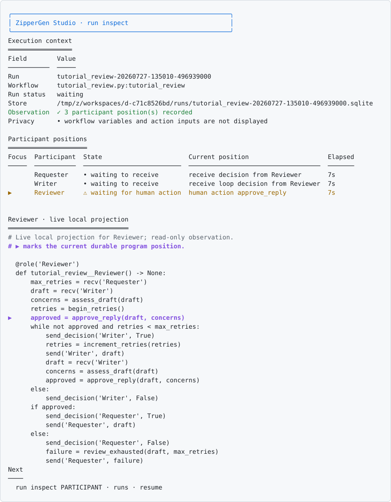
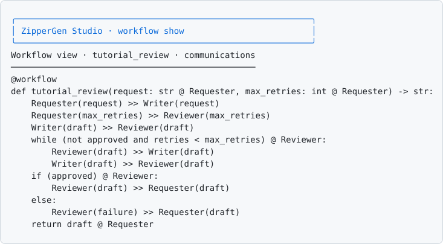
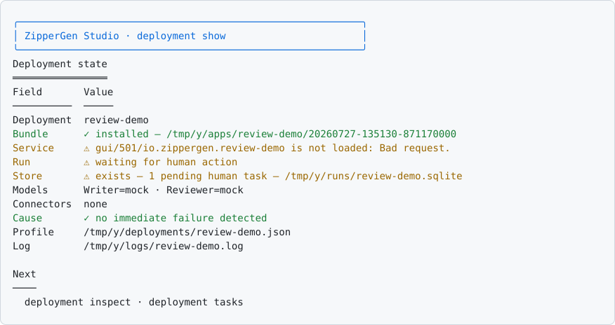

<p align="center">
  
</p>

<p align="center">
  <a href="https://github.com/zippergen-io/zippergen/actions/workflows/test.yml"></a>
  <a href="https://arxiv.org/abs/2604.17612"></a>
</p>

Multi-agent systems scatter coordination across agents and callbacks. The
complete message order becomes hard to read, and a blocked run is hard to
diagnose.

ZipperGen puts that coordination in one readable Python protocol. It projects
the protocol into a local program for each participant, runs them durably,
shows exactly where each participant is waiting, and deploys the result as a
real service.

Coordination deadlocks are ruled out by construction, not by runtime checks.
This guarantee applies to well-formed workflows in ZipperGen's supported
language.

## Contents

- [See the current program position](#see-the-current-program-position)
- [Quick start](#quick-start)
- [What Studio looks like](#what-studio-looks-like)
- [Why protocols](#why-protocols)
- [Hello, ZipperGen](#hello-zippergen)
- [Inspect workflows as code](#inspect-workflows-as-code)
- [Assistant safety](#assistant-safety)
- [Durable runs and deployment](#durable-runs-and-deployment)
- [Examples and documentation](#examples-and-documentation)
- [Formal foundation](#formal-foundation)

## See the current program position

Studio can show the local program for one participant and mark its current
statement. The view stays bounded even when a workflow contains a long loop.
It also shows why the other participants are waiting.



This is real output from a mock run that is waiting for human approval. The
view does not display workflow values, prompts, credentials, or action inputs.

## Quick start

The published PyPI alpha does not yet contain the current Studio preview. For
now, install and run the current source:

```bash
git clone https://github.com/zippergen-io/zippergen.git
cd zippergen
uv sync
uv run zippergen run examples/hello.py:hello --llm mock --input 'topic=Say hello to ZipperGen'
```

The last command runs a complete two-participant workflow without an API key.
It returns a mock result and writes a durable SQLite store.

Requirements:

- Python 3.11 or later
- [uv](https://docs.astral.sh/uv/)
- macOS or Linux for the current managed deployment path

Open Studio from the same directory:

```bash
uv run zippergen
```

Codex and Claude Code are optional. You need one of them only when you ask
Studio to generate or change workflow source from a natural-language
specification.

## What Studio looks like

Studio keeps the main path short:

```text
workflow create
workflow implement codex
workflow review
run
deploy
```

`workflow create` opens one versioned `specification.md`. A coding assistant
may implement that specification as ordinary Python code and focused tests.
The assistant never deploys the result. Studio keeps validation, inspection,
human acceptance, and deployment as explicit steps.

Commands are grouped by purpose:

| Area | What it covers |
|---|---|
| `workflow` | Specification, implementation, views, validation, review |
| `models` | Providers, named configurations, checks, assignments |
| `run`, `resume`, and `runs` | Durable development execution, decisions, traces, recovery |
| `deployment` | Bundles, services, durable state, decisions, logs, connectors |

Tab completion shows valid commands, workflows, participants, model
configurations, and deployments. `current` gives one project summary. Every
structured result ends with a useful `Next` section.

### Read the communication protocol

The communication-only view hides local action details. It keeps messages,
loops, decisions, and ownership visible.



Other views show an overview, the full protocol, actions and prompts, complete
source, selected participants, or one exact local projection.

### Understand a deployment

`deployment show` separates the installed bundle, service process, workflow
run, SQLite store, model routing, connectors, and likely failure cause.



This real capture shows a deployment running in the foreground. Its immutable
bundle is installed. The workflow is waiting for human action in its durable
store. The user service is not loaded because this capture used the foreground
path.

## Why protocols

Many agent frameworks spread control flow across agents and callbacks. That
makes the complete communication order hard to read. It can also make a blocked
system hard to diagnose.

ZipperGen starts from one global protocol. A participant is called a
**lifeline**. A lifeline can represent an agent, a person, a mailbox, or an
external-system role.

Projection gives each lifeline only the sends, receives, decisions, and local
actions it needs. Within ZipperGen's supported workflow language, a well-formed
global protocol projects to compatible local programs. The formal result gives
behavior preservation and deadlock freedom for the generated coordination.

The global workflow is useful before and after execution:

- It is readable design documentation.
- It is executable Python code.
- It defines every communication and decision owner.
- It produces exact local programs.
- It gives runtime inspection a precise program position.

ZipperGen is based on [Message Sequence
Charts](https://en.wikipedia.org/wiki/Message_sequence_chart) and
[choreographic programming](https://en.wikipedia.org/wiki/Choreographic_programming).

Message Sequence Charts are useful for explaining a short protocol. Local
projections are better for inspecting long-running loops.

## Hello, ZipperGen

This workflow has two lifelines, one LLM action, and two messages:

```python
from zippergen import Lifeline, llm, workflow

User = Lifeline("User")
Writer = Lifeline("Writer")


@llm(
    system="Write a concise reply.",
    user="{topic}",
    parse="text",
    outputs=(("draft", str),),
)
def write_reply(topic: str) -> None: ...


@workflow
def hello(topic: str @ User) -> str:
    User(topic) >> Writer(topic)
    Writer: draft = write_reply(topic)
    Writer(draft) >> User(draft)
    return draft @ User
```

Run the complete file with the built-in mock backend:

```bash
uv run zippergen run examples/hello.py:hello \
  --llm mock \
  --input 'topic=Say hello to ZipperGen'
```

The `@ User` annotation says that `User` owns the input and final result. The
message expressions state exactly when ownership moves between lifelines.

Owned decisions use the same notation:

```python
if approved @ Reviewer:
    Reviewer(draft) >> Requester(draft)
else:
    Reviewer(concerns) >> Writer(concerns)
```

`Reviewer` owns this decision. ZipperGen projects the needed control messages
to the other lifelines.

A large workflow can use `@fragment` helpers. Fragments keep the global
protocol readable. They are expanded before validation and projection.

## Inspect workflows as code

The scriptable CLI exposes the same views as Studio:

```bash
uv run zippergen validate examples/tutorial_review.py:tutorial_review

uv run zippergen show \
  examples/tutorial_review.py:tutorial_review \
  --communications

uv run zippergen show \
  examples/tutorial_review.py:tutorial_review \
  --agent Reviewer

uv run zippergen show \
  examples/tutorial_review.py:tutorial_review \
  --detail full
```

Useful Studio forms:

```text
workflow list
workflow select
workflow show
workflow show communications
workflow show agent Reviewer
workflow validate
workflow diff
workflow review
workflow accept
```

Validation and acceptance answer different questions:

- `workflow validate` is a machine check. It checks structure, projection,
  metadata, and canonical rendering.
- `workflow accept` records a human decision that the reviewed intent and code
  are ready.

Running a candidate locally is useful. Deploying code that changed after human
acceptance is blocked until the user reviews the difference or records an
explicit override.

## Assistant safety

Studio can call Codex or Claude Code during development. A workflow can also
declare a first-class `@assistant` action that runs inside the protocol.

Assistant actions have three visible capability axes:

| Axis | Default | Meaning |
|---|---|---|
| `access` | `read-only` | Repository read or write access |
| `external_tools` | `none` | MCP, dedicated web tools, and configured integrations |
| `shell` | `restricted` | Strongest practical backend-specific shell boundary |

Security-relevant examples should state all three axes:

```python
@assistant(
    instructions_file="prompts/update_release_notes.md",
    access="write",
    external_tools="none",
    shell="restricted",
    workspace=".",
)
def update_release_notes(change: str) -> str: ...
```

These fields always appear in semantic snapshots and diffs.

The effective restricted shell differs by backend:

- Codex keeps command execution inside its read-only or workspace-write
  sandbox. Network access is disabled when external tools are disabled.
  Strict configuration parsing makes unsupported isolation settings fail.
- Claude receives no Bash tool. `shell="enabled"` gives Claude Bash access but
  does not give the same structural network isolation. Validation warns about
  this choice.

For a stronger provider-independent boundary, let the assistant edit without a
shell. Run a fixed verification command in a separate visible `@effect`.
Never execute a command string produced by an assistant.

Write access does not imply permission to deploy, restart services, commit,
push, or modify unrelated systems. The static instruction should state those
boundaries. Validation warns when a write workspace contains the executing
workflow itself.

## Durable runs and deployment

Development runs use SQLite by default. Messages, completed actions, human
tasks, traces, results, and participant positions survive terminal closure and
computer restart.

Inside Studio:

```text
run
run inspect
run inspect Reviewer
run tasks
run approve
run trace
resume
runs
```

Every new development run gets its own managed durable state. Users work with
the run and do not need to manage SQLite files.

A named deployment owns one stable logical store and an immutable source
bundle:

```text
deploy review-demo --no-start
deployment doctor review-demo
deployment show review-demo
deployment start review-demo
deployment inspect review-demo
deployment tasks review-demo
deployment approve review-demo
deployment trace review-demo
deployment logs review-demo
deployment restart review-demo
deployment stop review-demo
```

The service policy restarts failed workflows. It does not restart a finite
workflow after successful completion.

Logical connectors are declared without credentials in workflow source.
Studio keeps named connector configurations and private credentials outside
Git:

```text
deployment connectors
deployment connectors setup telegram
deployment connectors check telegram-approvals
deployment connectors bind human-approval telegram-approvals
deployment notify
```

Telegram task delivery is available now. Gmail and Google connector work is
still in progress.

## Examples and documentation

Start with these examples:

| Example | What it shows |
|---|---|
| [`hello.py`](examples/hello.py) | Two lifelines and one LLM action |
| [`tutorial_review.py`](examples/tutorial_review.py) | Retry loop and human approval |
| [`parallel.py`](examples/parallel.py) | Parallel branches |
| [`command_center.py`](examples/command_center.py) | Long-running application loops |
| [`codex_claude_review.py`](examples/codex_claude_review.py) | Bounded coding-assistant review loop |
| [`assistant_maintenance.py`](examples/assistant_maintenance.py) | First-class assistant action |

Documentation:

- [Your First ZipperGen Workflow](docs/first-workflow.pdf)
- [Development and Deployment Manual](docs/workflow-development-deployment-guide.pdf)
- [Tutorial TeX source](docs/first-workflow.tex)
- [Manual TeX source](docs/workflow-development-deployment-guide.tex)
- [Workflow authoring skill](.agents/skills/zippergen-workflows/SKILL.md)

The first document is the shortest complete path. The manual contains the
concepts, full command reference, model setup, durable execution, connectors,
deployment, recovery, and troubleshooting.

The PDFs are built from the committed TeX sources:

```bash
make docs
```

## Formal foundation

The main result states that the projected local programs produce the same
behaviors as the global workflow. Deadlock freedom follows for well-formed
workflows in the supported formal model.

The main theorems are machine-checked in Lean 4. The formal results are
described in these papers:

- [Provable Coordination for LLM Agents via Message Sequence
  Charts](https://arxiv.org/abs/2604.17612)
- [Causal Past Logic for Runtime Verification of Distributed LLM Agent
  Workflows](https://arxiv.org/abs/2605.20923)

Causal Past Logic supports runtime conditions over causally visible distributed
state. It complements the design-time protocol and projection guarantees.

## License

ZipperGen is released under the Apache License 2.0. See
[`LICENSE`](LICENSE) for the full terms.
